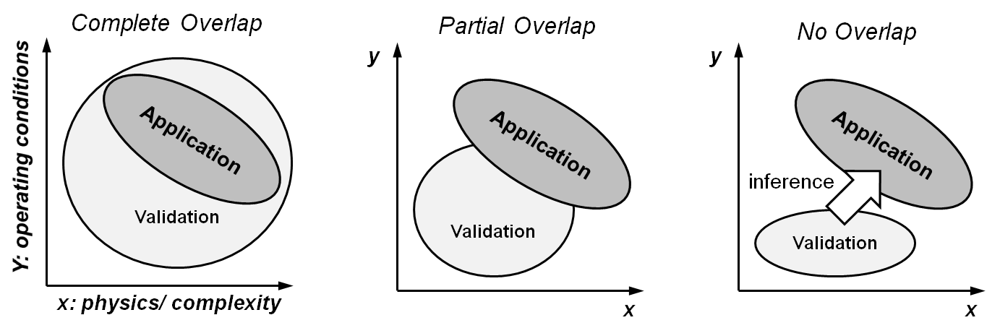
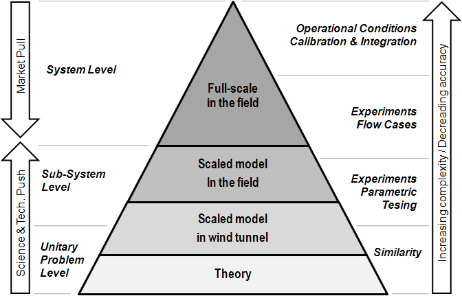
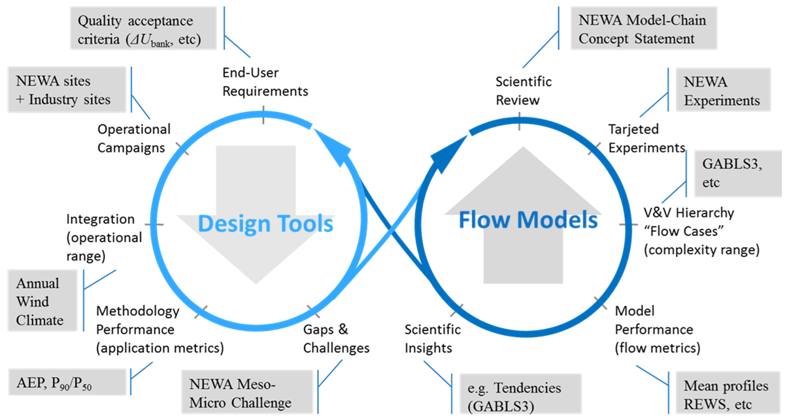

Model Evaluation Protocol
=========================

Introduction
------------
WEMEP addresses quality assurance of models being used for research and to drive wind energy applications. This is achieved through a framework to conduct formal verification and validation (V&V) that ultimately determines how model credibility is built upon. The protocol is based SANDIA's **V&V Framework** :cite:`Hillsetal_2015` which, itselft, is based on well-established procedures developed by various organizations including the Department of Energy, National Aeronautics and Space Administration, the American Institute of Aeronautics and Astronautics, and the American Society of Mechanical Engineers. Background articles include :cite:`Oberkampf&Trucano_2002`, :cite:`Oberkampfetal_2004` and :cite:`Oberkampf&Barone_2006`. The framework's primary focus is *to provide guidance on the development and execution of tightly integrated modeling/experimental programs based on well-established V&V practices for the purpose of model assessment*.

Based on the AIAA guide for V&V of computational fluid dynamics (CFD) :cite:`AIAA_1998`: 

* **Verification** is the process of determining that the model implementation accurately represents the developer’s conceptual description of the model and the solution of the model. Here accuracy is measured with respect to benchmark solutions of simplified model problems

* **Validation** is the process of determining the degree to which the model is an accurate representation of the real world from the perspective of the intended uses of the model. Here accuracy is measured with respect to experimental data.

The AIAA guide states that verification and validation are processes or ongoing activities without a clearly defined completion point. It is a matter of performing as many V&V exercises as possible in order to gain confidence and credibility on the model results towards the specific intended use of the model. Indeed, the *intended use*, i.e. the target application, is the main driver of this process to define the physical scope of the design system, its range of operating conditions, the variables of interest and their associated acceptance criteria. These acceptance criteria are defined in terms of error metrics that should be unified by the user community. 

The intrinsic high complexity of the wind energy design system makes it very difficult to validate the full range of operating conditions. Hence, it is implicit that a validated model will use inference methodologies to extrapolate performance from the validation space to the operational space (:numref:`fig-validation-application`). Therefore, the main objective of the validation process is to develop and quantify enough confidence on the computer model (or code) so that they can be used reliably to predict the quantities of interest within acceptable limits. Hence, validation is sometimes also referred to the assessment of the *predictive capacity* of a code.

.. _fig-validation-application:

    Different scenarios of validation vs application space (adapted from :cite:`Oberkampfetal_2004`).

Based in Europe, it is also worth mentioning the **COST-732 Model Evaluation Guidance and Protocol Document** :cite:`Britter&Schatzmann_2007` with focus on microscale modeling for the dispersion of pollutants in the urban environment. The protocol comprises the following aspects:

* A scientific evaluation process, that considers the formulation of the models in terms of physics included and the degree of suitability for the intended use. 
* A verification process that addresses both the code (consistency with the conceptual model) and the solution procedure (to estimate the numerical error)
* The provision of appropriate and quality assured validation datasets. 
* A model validation process in which model results are compared with experimental datasets.
* An operational evaluation process that reflects the needs and responsibilities of the model user.

Quoting COST-732, *models of whatever type are only of use if their quality (fitness-for-purpose) has been quantified, documented, and communicated to potential users* :cite:`Britter&Schatzmann_2007`. Hence, WEMEP will define the framework that wind energy model developers can follow to make their codes trustfull for the wind energy community. Trust is built when the code performance has been tested and quantified based on appropriate datasets agreed upon to cover a relevant range of applicability. This protocol shall also support the planning, setting up and execution of forthcoming experiments that will feed the validation process as a sistematic and sustained activity for model development. 

Scope and Objectives
--------------------
WEMEP is a community project with the following objectives: 

* To develop an **international framework** to guide model developers and end users on methodologies and best practices to conduct formal verification, validation and uncertainty quantification (VV&UQ).
* To promote collaboration between modeling communities and foster **interdisciplinary research** and development towards integrated models.  
* To make model evaluation **traceable** through best practices for model evaluation and benchmarking and through open-access repositories of models, validation cases and data analysis scripts.

The protocol is defined in generic model-agnostic terms so it can be adopted by any modeling community. Then, each community can document their interpretation of the protocol in the definition of suitable validation strategies for the intended uses of their models. Ultimately, this results in the definition of a hierarchy of verification and validation cases of increasing complexity. These cases are curated by the community through model intercomparison benchmarks archived as public data repositories. Knowledge gaps identified in the V&V process are addressed by planning, setting up and executing targeted experiments.  
     
The protocol is launched from the `IEA Wind TCP Task 31 Wakebench <https://community.ieawind.org/task31/home>`_ which is focused on the evaluation of wind farm flow models. This includes models for the atmospheric boundary layer, to simulate wind conditions for wind resource and site suitability assessment, as well as wake models for the assessment of wind farm array efficiency and loads in connection to wind farm design.

Modeling communities are welcomed to implement the protocol and contribute with open access repositories that can be interopeable with those from other communities.

Terminology
-----------
The most important keywords of the evaluation process are defined next, extracted from :cite:`Holmesetal_2013`. The purpose of this list is to adopt a common terminology when discussing model evaluation results. Terms are ordered alphabetically:

* **Benchmark**: Typically in literature this is defined as an analytical or highly accurate numerical solution for use in verification :cite:`Britter&Schatzmann_2007`.  However, this term is often being used to describe experimental datasets for use in validation, therefore care should be taken when using this term to clarify the accurateness and purpose of the dataset.

* **Blind test**: Comparison of numerical results with experimental data, where modelers are not allowed access to the experimental dataset.

* **Error**: Inaccuracy of the numerical model i.e., insufficient time-step resolution or spatial grid convergence. This can be known error due to limitations in implementing the mathematical equations (acknowledged error) or unknown error from mistakes (unacknowledged error).

* **Scientific evaluation**: Determining the appropriateness of the conceptual model in describing the real world application, includes three parts: scientific review, verification and validation.

* **Extrapolation**: Using a numerical model to simulate a process outside the range of which it was previously validated.

* **Conceptual model**: System of mathematical equations, governing laws, initial and boundary conditions that describe the physical process of interest in the selected real world application.

* **Computational model**: Implementation of the conceptual model into computer code.

* **Metric**: Variable used to quantitatively compare results from a numerical model with experimental data, typically with specified criteria for validation.

* **Numerical calibration**:  Utilizing field measurements, ensuring the proper scaling and units, as input parameters to the numerical model that are not a priori known.

* **Numerical model**: Another term for conceptual or computational model, this term is provided to distinguish between wind tunnel data and computer simulations.

* **Physical model**: Non-numerical modeling of a real world process; i.e., using a wind tunnel or water tunnel to model a real world process to provide a high quality dataset for the validation of computational models.

* **Prediction**: The output from a validated numerical simulation, for a specific real world process that is within the modeling capabilities deemed acceptable from the numerical model validation.

* **Quantity of interest**: Output variable from numerical model to compare directly with experimental data, the metric is used to quantitatively compare the two results.

* **Real world**: Determination of the physical process to be investigated, examples for wind energy applications include wind flow patterns and flow around a wind turbine.

* **Scientific review**:  The first step in model evaluation, it is an investigation of the scientific basis of a numerical model, which physical processes are included, how they are modeled, assumptions, approximations, solution techniques and the interface and resources available to the user.

* **Tuning**: Making adjustments to parameters in the numerical model based on the comparison between the model output and field measurements, not considered orthodox validation since it is not a blind test.

* **Uncertainty**: Recognizable inaccuracies of the model that are not due to a lack of knowledge.  This can be due to inherent variability in the physical process (aleatory uncertainty) or from a lack of scientific understanding (epistemic uncertainty).  Epistemic uncertainty can be improved by increasing modeling skill or understanding.

* **Validation**: Ensuring the physical processes are accurately modeled, this involves a comparison of the computational results with experimental data.

* **Variability**: In this case of wind energy this is the aleatory uncertainty attributed to the irregularity of turbulent processes in the atmosphere.

* **Verification**: Ensuring the mathematical accuracy of the computational model, including accurate implementation of equations (Solution Verification) and checking the computer code for errors (Code Verification).

Building-Block Approach
-----------------------

The building-block model evaluation approach analyzes a complex system, consisting for instance of of a wind farm and its siting and environmental conditions, by subdividing it in subsystems and unit problems to form a hierarchy of test cases with a systematic increase of complexity (:numref:`fig-building-block-approach`) (:cite:`AIAA_1998`)

.. _fig-building-block-approach:

    Building-block model evaluation approach.

The building-block approach allows isolating individual or combined elements of the system, to segregate relevant physical phenomena in a more controlled setting that can be characterized more easily, and evaluate the predictive capacity of a model and estimate the potential impact of those elements on the full system performance. The process typically implies analyzing idealized conditions using theoretical approaches like similarity theory, parametric testing in a controlled environment with scaled-down models in wind tunnels and field testing of scaled or full-scale prototypes in research conditions as well as operational units in operational conditions. This hierarchy of increasing physical complexity is typically associated with decreasing levels of accuracy, in terms of data quality and resolution, because of practical as well as economical limitations. As mentioned previously, the validation space will always be limited to a limited range of system configurations and flow cases. The ultimate step in the building-block approach requires testing the model in operational conditions, where all phenomena are integrated. Here, the model can be calibrated and, eventually, fine-tuned to improve its predictive capacity (reduce bias and uncertainty).

The Model Evaluation Process
----------------------------

The evaluation process can be considered an intrinsic part of technology innovation, i.e. translating ideas into added value of a product or service to meet specific needs. The innovation process originates from understanding the market needs, following a top-down or market-pull approach (:numref:`fig-building-block-approach`) to define challenges that technology should solve. Alternatively, bottom-up or science-push innovation will use new knowledge to improve the "state-of-the-art" that feeds into the technology. In practice, both coexist although the market-pull approach should be the main driver to set expectations and avoid anchoring to knowledge niches. 

In wind assessment applications, the product shall be a design tool whose core technology is a computational model. Innovation implies improving the predictive capacity of the model through better physical insight. Then, we use the model evaluation process to design experiments and validation cases that will allow us to test if certain model capabilities work as expected according to our conceptual model (our idea) and, more importantly, if this is actually adding value to the design tool.        

This dual organization of the V&V process, in terms of interconnected exploration and exploitation cycles, can be described as an ambidextrous V&V process, in analogy with the term ambidextrous organization that would relate research and operational activities in the innovation process (O’Reilly and Tushman, 2004). 

.. _fig-ambidextrous-process:

    Ambidextrous model evaluation process implemented in the NEWA project (Sanz Rodrigo, 2019).

:numref:`fig-ambidextrous-process` illustrates this process in the context of the NEWA challenge of producing wind resource assessment methodologies based on a mesoscale-to-microscale model chain (Sanz Rodrigo, 2019). The challenge leads to formulating a concept for the model-chain through scientific review (Sanz Rodrigo, 2016c) and devising experiments to target all the relevant phenomena that should be captured. A validation hierarchy is defined to address these phenomena in a systematic way of increasing complexity (Sanz Rodrigo et al, 2016b). For example, :numref:`fig-ambidextrous-process` shows how the GABLS3 benchmark was used to demonstrate meso-micro coupling methodologies in the simulation of ABL flow along a diurnal cycle in flat terrain conditions. This case was used to implement the “tendencies” approach in microscale CFD models, which was then tested in operational conditions by integrating the model over one year at the Cabauw site to quantify performance in terms of relevant quantities of interest for wind resource assessment such as annual energy prediction (AEP). This model evaluation cycle is described in detail in Section 4, and shall be repeated as many times as possible to progressively incorporate detailed flow cases from experimental campaigns to improve the physical insight of the model, at the right-hand side of the cycle, and long-term operational campaigns at the left-hand side to improve the statistical significance of the model in the application space.  

Validation-Directed Program Planning 
------------------------------------

Setting objectives 
^^^^^^^^^^^^^^^^^^

Phenomena Identification Ranking Table (PIRT) 
^^^^^^^^^^^^^^^^^^^^^^^^^^^^^^^^^^^^^^^^^^^^^

Validation Hierarchy
^^^^^^^^^^^^^^^^^^^^

Integrated Experiment, Model Planning and Execution 
---------------------------------------------------

Experiment design
^^^^^^^^^^^^^^^^^

Verification
------------

Code Verification
^^^^^^^^^^^^^^^^^

Solution Verification
^^^^^^^^^^^^^^^^^^^^^

Validation
----------

Setting up of a validation benchmark
^^^^^^^^^^^^^^^^^^^^^^^^^^^^^^^^^^^^

Validation assessment at system level 
^^^^^^^^^^^^^^^^^^^^^^^^^^^^^^^^^^^^^

Uncertainty Quantification
--------------------------

Aleatory and epistemic uncertainty 
^^^^^^^^^^^^^^^^^^^^^^^^^^^^^^^^^^

Sources of uncertainty
^^^^^^^^^^^^^^^^^^^^^^

Experimental uncertainty
^^^^^^^^^^^^^^^^^^^^^^^^

Computational model uncertainty
^^^^^^^^^^^^^^^^^^^^^^^^^^^^^^^

Blind Testing 
-------------

Blind Testing
^^^^^^^^^^^^^

Model Calibration
^^^^^^^^^^^^^^^^^

Documenting
-----------

Data Management
---------------

Data Provision
^^^^^^^^^^^^^^

Licensing
^^^^^^^^^

References
----------
.. bibliography:: references.bib
	:all:

