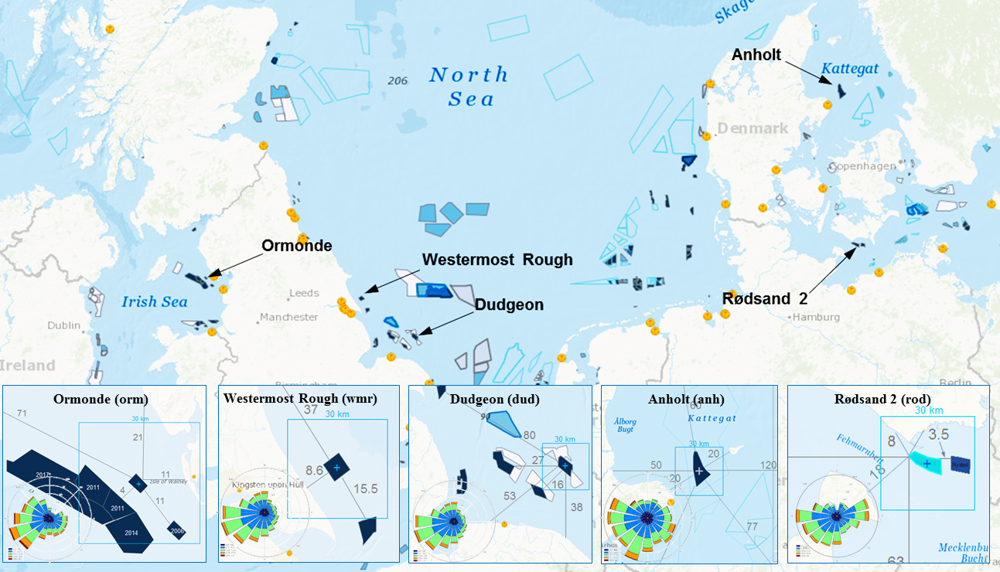

OWA Wake Modelling Challenge  (OWAbench)
========================================

Status
------
.. admonition:: June 2020

   The Offshore Wind Accelerator (OWA) Wake Modelling Challenge was organized within Wakebench Phase 3 with support from the OWA partners. The results were presented at the Torque-2020 conference. 

	   * Observational data: not available
	   * `Input and simulation data <https://zenodo.org/record/3715198>`_ :cite:`sanz_rodrigo_owa_2020a`
	   * `Evaluation scripts <https://zenodo.org/record/3773129>`_ :cite:`sanz_rodrigo_owa_2020b`
	   * `Presentation <https://zenodo.org/record/4321054>`_ :cite:`sanz_rodrigo_owa_2020c`; `YouTube video <https://www.youtube.com/watch?v=jjqx2bmUTFg&t=3889s>`_
	   * `Paper <https://doi.org/10.1088%2F1742-6596%2F1618%2F6%2F062044>`_ :cite:`rodrigo_validation_2020`

   **Highlights**

   The OWA Challenge finished with 11 participants submitting results from 15 different wake models. While  engineering models can predict the overall array efficiency with a bias of a few percent, this is through compensation of errors at turbine level and between wind climate bins that can be larger than 20%. The assessment is challenged by the lack of undisturbed measurements of the gross power which can show variations of more than 20% across large wind farms under the influence of farm-farm and coastal horizontal wind speed gradients.  

	.. _fig-OWAbench-results:
	.. figure:: ../../_static/wakes/benchmarks/owa_results.png
	    :width: 600
	    :align: center

	    Array efficiency prediction bias for 5 offshore wind farms (left). Histogram of bias at turbine level for the Dudgeon wind farm at different stabilities (right) `© Author(s) 2014. CC BY 3.0 License <https://doi.org/10.1088%2F1742-6596%2F1618%2F6%2F062044>`_. Used with permission. :cite:`rodrigo_validation_2020`   

Scope and Objectives
--------------------
The primary objective is to understand the limitations of wake models used by industry for the prediction of array efficiency over a relevant range of operational conditions in the offshore environment. To this end the following individual objectives are agreed with OWA partners:

* Evaluate wake modelling and power prediction methods and validate the results with measured data.
* Examine the accuracy of specific models, quantify uncertainty bands and highlight modelling trends.
* Define an open-access model evaluation methodology that can systematically improve consistency and traceability in the assessment of state-of-the-art wake models for power prediction as more datasets are added. 

Benchmarking Approach
---------------------
The benchmark consists on three stages:

1. **Blind test pilot**: Benchmark participants don't have access to the validation data, only the benchmark manager. The Anholt case is launched first as a pilot to develop the model evaluation methodology together with the participants as they are engaged. Evaluation scripts are shared with the participants so they can run their own assessment and submit the best prediction.    
2. **Blind test multisite**: The blind test is extended to the other sites as soon as the input data is available. Participants with engineering models should submit predictions for all the sites and bins. Participants using CFD models can limit the submission to one wind direction sector (indicated below) to limit the computational effort. 
3. **Calibration**: One benchmark participant from the blind test phase is selected to iterate further with a model using calibrated input data. Since observational data cannot be shared, a sensitivity analysis on model parameters is used as a proxy to analyze model calibration.

Registered participants receive an identification code (*userID*) which they use to submit their data and identify their results in an anonymous model intercomparison. They are also required to fill in a questionnaire providing details about their simulations to facilitate the assessment of the results as well as their data-sharing position.

Background
----------
The OWA Wake Modeling Challenge is an Offshore Wind Accelerator (OWA) project that aims to improve confidence in wake models in the prediction of array efficiency. Model developers and end-users were invited to participate in a benchmarking exercise along a suite of validation datasets that spans a wide range of operational conditions in terms of wind farm topology and wind climate characteristics.

The validation strategy focuses on large offshore wind farms and turbines, of up to 6 MW, and addresses limitations of engineering wake models, traditionally developed under the assumption of surface-layer inflow conditions (horizontally homogeneous, steady-state). In effect, large wind farms are subject to heterogeneous inflow conditions due to coastal gradients, wakes from neighboring wind farm clusters and large-scale mesoscale phenomena. The interaction of the atmospheric boundary-layer (ABL) with the wind farm canopy includes different processes from the upstream blockage of the flow to the generation of an internal boundary-layer that, in very large arrays, results in a fully developed wind farm boundary layer where turbulent mixing between wake effects and the outer ABL is in equilibrium and array efficiency becomes constant (deep-array effect). Under stable conditions the ABL height is compressed to a few hundred meters and a low-level jet forms. In the presence of large wind farms, this low-turbulence regime generates long-lasting wakes and introduces significant blockage in the incoming flow which results in important array efficiency reductions compared to neutral or unstable conditions. Within the wind farm, local acceleration effects near corners or within gaps are opportunities for wind farm design optimization. Altogether, the complex system is the result of a multi-scale process that requires a systematic assessment to understand the relative importance of each phenomenon in the prediction of array efficiency for energy yield assessment and wind farm design.  

Sites Description
^^^^^^^^^^^^^^^^^
The validation consists of 5 sites distributed in Northern European wind climates (:numref:`tab-windfarms-description`, :numref:`fig-owa-map`).

.. _fig-owa-map:

    Offshore sites. Distances indicated in km. Windroses for the the evaluation period of :numref:`tab-windfarms-description`. Basemaps from `4Coffshore.com <https://www.4coffshore.com/>`_ as of October 2019.

.. _tab-windfarms-description:
.. table:: Wind farm characteristics, geographical location and evaluation periods :cite:`rodrigo_validation_2020`.
   :class: longtable

   +------------+------------+-------+-------+--------+--------+-------------------+-------------+-------------------+-----+-----------------+
   | Wind Farm  | Data       | LON   | LAT   | From   | To     | :math:`P_{total}` | :math:`N_t` | :math:`P_{rated}` | D   | :math:`z_{hub}` |
   |            | Provider   | (°)   | (°)   |        |        | (MW)              |             | (MW)              | (m) | (m)             |
   +============+============+=======+=======+========+========+===================+=============+===================+=====+=================+
   | Anholt     | Ørsted     | 11.2  | 56.6  | Jan-13 | Jun-15 | 399.6             | 111         | 3.6               | 120 | 82              |
   +------------+------------+-------+-------+--------+--------+-------------------+-------------+-------------------+-----+-----------------+
   | Dudgeon    | Equinor    | 1.38  | 53.26 | Dec-17 | Nov-18 | 402               | 67          | 6                 | 154 | 110             |
   +------------+------------+-------+-------+--------+--------+-------------------+-------------+-------------------+-----+-----------------+
   | Rødsand 2  | EON        | 11.46 | 54.57 | Feb-13 | Jun-14 | 207               | 90          | 2.3               | 82.4| 68.5            |
   +------------+------------+-------+-------+--------+--------+-------------------+-------------+-------------------+-----+-----------------+
   | Westermost | Ørsted     | 0.15  | 53.80 | Jan-16 | Dec-17 | 210               | 35          | 6                 | 154 | 106             |
   | Rough      |            |       |       |        |        |                   |             |                   |     |                 |
   +------------+------------+-------+-------+--------+--------+-------------------+-------------+-------------------+-----+-----------------+
   | Ormonde    | Vattenfall | -3.44 | 54.09 | Jan-12 | Feb-19 | 150               | 30          | 5                 | 126 | 100             |
   +------------+------------+-------+-------+--------+--------+-------------------+-------------+-------------------+-----+-----------------+

Meso-Wake Framework
^^^^^^^^^^^^^^^^^^^
In the absence of free-stream meteorological observations, a mesoscale-to-wake modelling framework is established whereby mesoscale simulations are provided as input data for the modellers to interpret in connection to their wake models. Then, the power predicted at turbine position *i* can be defined as:

.. math:: P_i = P_{ref,i} A_{S,i} A_{M,i} = P_{wt,i} A_{M,i}

where :math:`A_{S,i}` and :math:`A_{M,i}` are correction factors to account for changes in power within the array, due to horizontal wind speed gradients, and mesoscale bias respectively. Assuming power-curve relationships between power and wind speed:

.. math:: A_{S,i} = \frac{P_i}{P_{ref}} \approx \left(\frac{S_i}{S_{ref}}\right)^3

.. math:: A_{M,i} = \frac{P_{obsfree,i}}{P(S_i)} \approx \left(\frac{S_{obsfree,i}}{S_i}\right)^3

where :math:`S_i` is the background mesoscale wind speed and :math:`S_{obsfree,i}` is the observed equivalent free-stream wind speed, which is obtained from the observed power :math:`P_{obsfree,i}` at wake-free turbines though the inverse of the power curve. Since :math:`S_{obsfree,i}` is deduced from the power of the free-stream turbines, we assume that potential effects of upstream wind farm induction are included in :math:`A_{M,i}`, which would correct for both mesoscale and induction or blockage. According to :cite:`bleeg_wind_2018` wind farm induction effects can result in up to 4% overestimation of array efficiency in engineering wake model when they operate at the maximum thrust coefficient. Hence, it is worth removing this effect in the assessment of array efficiency so we can be sure that it is only related to wake losses.

Input Data 
----------
Mesoscale simulations using the NEWA WRF set-up :cite:`hahmann_making_2020` :cite:`dorenkamper_making_2020` are produced to generate background wind conditions for wake models that are free of (microscale) site effects. The WRF set-up consists on three one-way nested domains of 27, 9 and 3 km resolution are configured centred at the wind farm centroid (:numref:`tab-windfarms-description`). The vertical grid has 61 terrain-following (sigma) levels, with 10 levels covering the first 200 meters, more specifically at: 6, 22, 40, 56, 73, 90, 113, 140, 179 and 205 meters. High resolution topography (SRTM 90m) and updated land use categories (Corine Land Cover 2018), together with the Noah land-surface model are used to define the boundary conditions at the surface. The physical parameterizations are: Mellor–Yamada–Nakanishi Niino 2.5-level planetary boundary-layer scheme (MYNN), WRF Single-Moment 5-class microphysics scheme, the Rapid Radiative Transfer Model for GCMs shortwave and longwave radiation schemes and the Kain-Fritsch cumulus scheme in the outermost domains 1 and 2. The simulation is driven by input data from ERA-5 in blocks of 5 days with additional spin-up time of 24 hours.

We use the centroid of the mesoscale simulation to define **reference wind conditions** in terms of hub-height interpolated wind speed and direction and surface-layer stability, defined by :math:`z/L` parameter where *z* = 10 m and *L* is the Obukhov length computed by WRF. Reference wind conditions are obtained by horizontal averaging those at the wind turbine sites. 

Neighbouring wind farms have also been simulated using the Fitch wind farm parameterization available in WRF. The innermost nest in the simulations has a horizontal resolution of 3 km. Following the same approach that was adopted in the EERA-DTOC project :cite:`schepers_dtoc_2015`, two sets of input data are generated:

* **Control** (*ctrl*): Free of wake effects, to characterize the background wind resource.
* **Wakes** (*wakes*): Includes neighbor wind farms but not the target wind farm, to characterize inflow conditions for microscale wake modeling.

For each mesoscale simulation two sets of data are derived:

* *_WindTurbines.nc*: time series of wind conditions interpolated at each turbine site.
* *_ref.nc*: horizontal average of *_WindTurbines.nc* to define reference wind conditions as if it was a *virtual mast* at the wind farm centroid.

Turbine layout coordinates are provided in the *_layout.csv* file. Generic power and thrust curves have been kindly provided by EMD.

All the input data is provided to registered participants through a *b2drop* input folder.

Validation Data
---------------
Supervisory control and data acquisition (SCADA) operational data is used to perform the validation for a period of at least one year (:numref:`tab-windfarms-description`). A quality control process has been carried out to produce a “clean” dataset that only includes situations where a turbine is working in nominal conditions, i.e. whose power output is close to the value predicted by the theoretical power curve and, therefore, corresponds to the operational conditions simulated by wake models in the pre-construction phase.

A machine learning technique is used for gap filling to recover time instances when only a few turbines are working in non-nominal conditions. In these situations, a regression algorithm trained on clean data from neighbour turbines predicts corrected data for the missing turbines to obtain a complete dataset. The effect on the overall array efficiency assessment is minor compared to the benefits of obtaining a validation dataset that is more statistically significant.
As a result, the quality-control corrected data consist of hourly timestamps of power output and nacelle wind direction with all the turbines working in nominal conditions. 

Then, validation data is defined in terms of sector-wise and stability-wise ensemble averages for 30º wind direction sectors and a 9±1 m/s velocity bin, when the thrust coefficient is at its maximum resulting in stronger wake effects. The data is subdivided into three stability classes according to the reference stability :math:`z/L` parameter simulated by WRF:

* **Unstable** (*u*): -0.2 < :math:`z/L` < -0.02
* **Neutral** (*n*): -0.02 < :math:`z/L` < 0.02
* **Stable** (*s*): 0.02 < :math:`z/L` < 0.2

Mesoscale and SCADA hourly data is synchronized and flagged to filter out registers in non-nominal conditions that will not participate in the validation.

Model Runs
----------
A fundamental question that the modeler has is how large does the microscale domain need to be. In a *single wind farm approach* we shall simulate the target wind farm at microscale with no explicit modeling of the shore or neighbor wind farms, since we trust that mesoscale simulations already include these effects. Then, you can assume horizontal homogeneity in the inflow conditions by using the reference virtual mast to define the inflow conditions for all the turbines (*WindFarm_Wakes_ref.nc*). Alternatively, you can use heterogeneous wind conditions at each wind turbine (*WindFarm_Wakes_WindTurbines.nc*, i.e. hub-height interpolated data).

The alternative, the *cluster approach*, will simulate the shore and wind farms situated close enough in the same microscale simulation using *ctrl* input data.

We suggest that all participants submit results following the single wind farm approach to come up with a consistent database of results based on the most simple and efficient approach. In the case of Rødsand 2 and Ormonde we will use both methods to understand the impact when the separation between wind farms is small.

Output Data
-----------
The ultimate goal is to analyse ensemble-averaged statistics of array efficiency :math:`\eta`, at individual turbine level and for the whole wind farm, defined as:

.. math:: \eta = \frac{\sum_{i}^{N_t} P_i} {\sum_{i}^{N_t} P(S_i)}

where :math:`P_i` and :math:`S_i` are the power and free-stream wind speed at turbine position *i*. Note that the gross power is defined in terms of the theoretical power curve, P(Si), at each turbine position as if it were operating in isolation. This is in contrast to previous validation studies that assumed uniform free-stream conditions for the entire wind farm. 

Since the intended use of the models focuses on energy yield assessment, we are interested in the validation of long-term averaged conditions, categorized by wind direction, wind speed and stability classes. Hence, the validation metrics will be based on bin-averaged conditions and not on the analysis of time series in connection to specific weather conditions.

Participants can submit their results as ensemble-averaged quantities or as time-series. Only formatted data following the benchmark guide should be submitted. You are encouraged to use the model evaluation script to test compatibility and self-assess your results by comparing with other model results that may be available. Please attach documentation that will help interpret your simulations and your self-assessment.

Input and output data is facilitated through shared folders in *b2drop*.

Remarks
-------
CFD modelers may consider submitting results for one wind direction sector to limit the computational effort.

* **Anholt**: WSW, with coastal effects.
* **Dudgeon**: WSW, with coastal and farm-farm effects.
* **Rødsand 2**: W, relatively homogeneous to characterize blockage (detailed analysis).
* **Westermost Rough**: WSW, with coastal effects.
* **Ormonde**: SW, behind a large cluster of wind farms.

References 
----------
.. bibliography:: owabench_references.bib
   :all:

Acknowledgements
----------------
The benchmark has been carried out with support from the Offshore Wind Accelerator *OWAbench* project. We would like to thank Carbon Trust and the OWA Technical Working Group for their support providing funding, operational data and guidance throughout the project. We would like to thank all the benchmark participants for their simulations and in-kind support in fine-tuning the benchmark set-up and evaluation methodology.  
