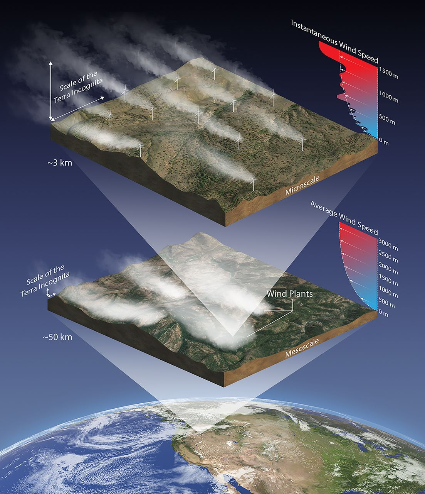
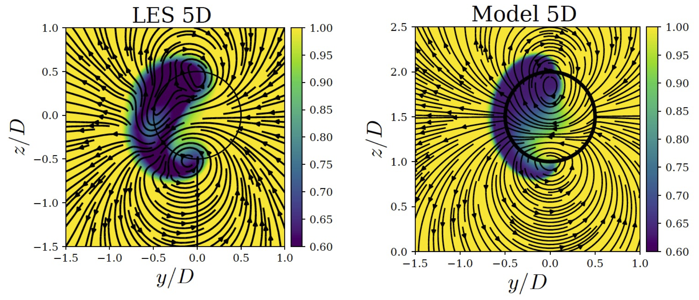
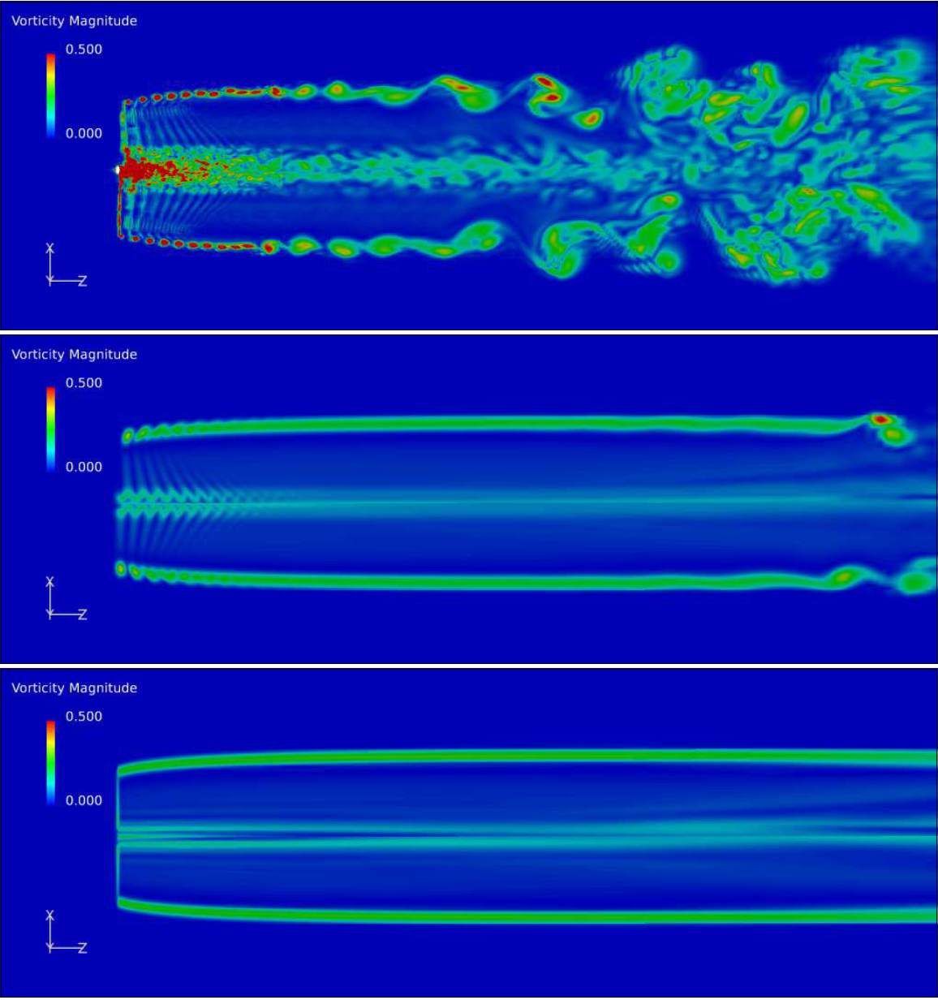
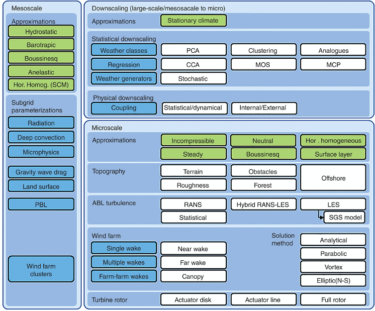
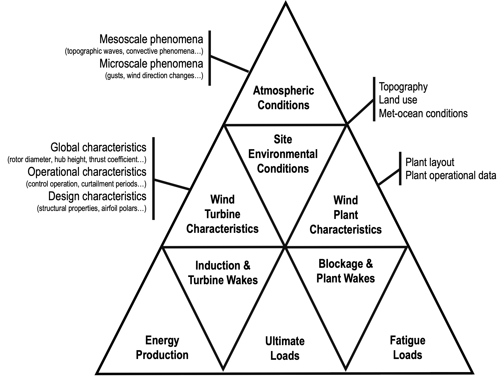
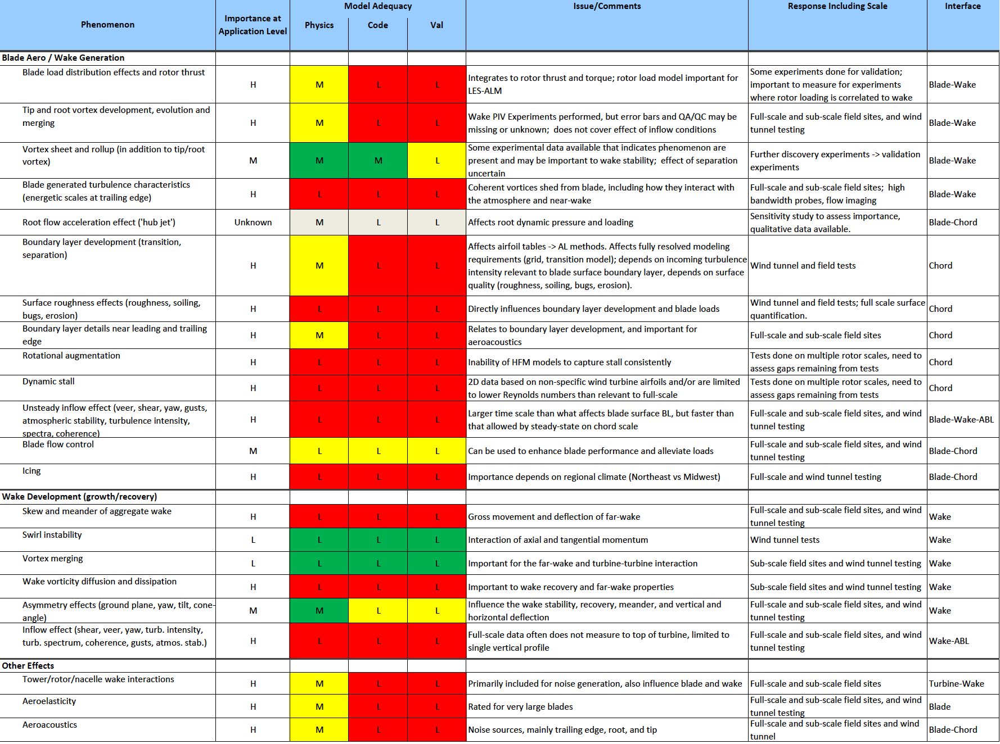
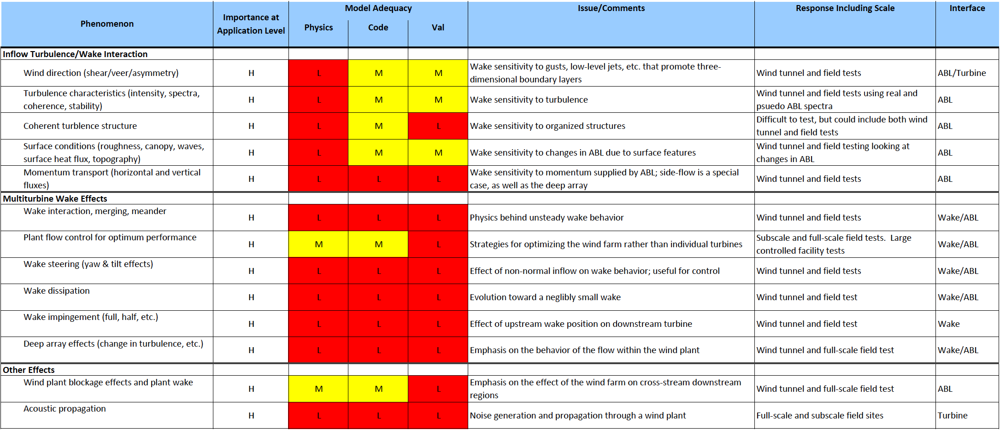

.. _Wakes:

Wakes
=====
*Wakes* is an umbrella term being used here to refer to the flow downwind of wind turbines and wind farms. This flow differs from the flow upwind of wind turbines and wind farms (which was the subject of :ref:`Wind Conditions`) for three main reasons: (i) operating wind turbines harvest kinetic energy from the wind; (ii) the tower and nacelle act as obstacles to the incoming flow; and (iii) the rotating blades add vorticity to the flow that passes through them. 

.. _fig-wakeschematic:

    Schematic from :cite:`veers_grand_2019` showing wind turbine and wind plant wakes relative to the global scale, mesoscale, and microscale atmospheric processes. Illustration made by Besiki Kazaishvili of NREL and available at `<https://science.sciencemag.org/content/366/6464/eaau2027>`_. © Authors 2019, some rights reserved; exclusive licensee American Association for the Advancement of Science.

Wind turbine wakes persist for a certain distance behind wind turbines until they finally mix out and regain their original energy levels. The amount of time and distance that it takes for them to recover depends on the atmospheric state and the ground characteristics of a site. In a wind farm setting, certain wind turbines will invariably find themselves in the wake of upstream wind turbines from time to time. These waked wind turbines will produce less power and experience more structural loading due to the lower wind speeds and higher turbulence levels in the wake. Therefore, a quantitative consideration of wakes---their expected location, strength, duration---is a critical aspect of wind farm planning and operation. 

Intended Use
------------
Wind turbine wake predictions are made with a variety of simulation tools which vary in their level of complexity and computational requirements. The most complex tools are used for research and the most simplified ones can be used for wind plant design and real-time control decisions. The IEA-Wind TCP Task 31 `Wakebench <https://community.ieawind.org/task31/home>`_ provides a robust and consistent framework for the validation of wind turbine wake models across a variety of applications, such as  :ref:`Wind Farm Design and Control`, :ref:`Wind Turbine Design` and :ref:`Research and Innovation`. 

.. _Wind Farm Design and Control:

Wind Farm Design and Control
^^^^^^^^^^^^^^^^^^^^^^^^^^^^

Wind turbine wake models applied to wind farm design and control are often referred to as engineering models. They need to be computationally inexpensive so that thousands of simulations can be performed in the search for optimal turbine layout within a given site. They also need to be fast so that real-time control decisions can be made. Therefore, rather than relying on nonlinear equations of fluid flow, engineering wake models are based on assumptions about the wake strength and shape and its evolution in space. Often, expressions for wake deflection and superposition are also included to better approximate the location of the wake in the farm and its interaction with other neighboring wakes.

In terms of the wake strength, it is commonly assumed that the wind speed deficit in the wake follows a normal (i.e. Gaussian) distribution laterally and vertically at a given distance downstream. This is a reasonable approximation in the far wake, which in the context of wind energy starts at approximately 3 rotor diameters downstream of the wind turbine :cite:`rodrigo_mesoscale_2017`. At the time of writing, the most commonly used analytical wake formulations in engineering codes are the Bastankhah and Porté-Agel model :cite:`bastankhah_new_2014` and the Ishihara and Qian model :cite:`ishihara_new_2018`. In the context of wake modeling for wind farm control, yaw misalignment between the rotor and the incoming wind can impart enough vorticity to the wake that it deviates from a round shape and acquires what is often called a curled shape. The ability to model this effect in engineering models has recently been developed :cite:`martinez-tossas_curled_2021`. Similarly, more sophisticated methods of modeling the interaction of wakes are also being proposed :cite:`bastankhah_analytical_2021`.

..
   XXX Add Figure 1 from Bastankhah, Majid, and Fernando Porté-Agel. “A New Analytical Model for Wind-Turbine Wakes.” Renewable Energy, Special issue on aerodynamics of offshore wind energy systems and wakes, 70 (October 1, 2014): 116–23. https://doi.org/10.1016/j.renene.2014.01.002. REQUESTED VIA EMAIL ON MAY 10 2021

.. _fig-curled_wake:

    The curled shape of a wind turbine wake as modeled in a large-eddy simulation (LES, left) and an engineering model (right) when the rotor is misaligned with the incoming wind by 30 degrees. The contour values are the streamwise wind speed given along lateral (y) and vertical (z) directions normalized by rotor diameter (D). Original image from :cite:`martinez-tossas_aerodynamics_2019` was clipped to show only one distance (5 D) downstream of the wind turbine. `© Author(s) 2021. CC BY 4.0 License <https://wes.copernicus.org/articles/4/127/2019/>`_. Free to share and distribute with proper attribution. 

.. _Wind Turbine Design:

Wind Turbine Design
^^^^^^^^^^^^^^^^^^^

A wind turbine placed in a wind farm will be affected by wakes throughout its lifetime. For this reason, wakes must be taken into account during the wind turbine design process. At the time of writing, the design standards for wind turbines :cite:`IEC_61400_1` specify two options for including these wake effects. The first and simplest option is to calculate the effective turbulence intensity that the turbine will experience. This so-called effective turbulence includes wake-related effects in addition to ambient turbulence effects :cite:`frandsen_turbulence_2007`. The second option is to use the dynamic wake meandering (DWM) model ensuring that the simulation tool takes into account the velocity deficit evolution, wake meandering, and wake-added turbulence :cite:`IEC_61400_1`.

.. _Research and Innovation:

Research and Innovation
^^^^^^^^^^^^^^^^^^^^^^^

In the context of research and technology innovation, we can identify a much wider fidelity spectrum of computational models being used for wake modeling. Models of higher fidelity typically require higher levels of computational resource and expertise to run. Simulations performed with these models, once validated, can be typically used to investigate the physical mechanisms governing wind turbine and wind plant performance and reliability, and to improve the lower-fidelity tools used in other applications. 

.. _fig-rotor-fidelities:

    Overview of detched-eddy simulation for three different levels of fidelity when modeling the wind turbine rotor: fully-resolved, actuator line, and actuator disk. Original figure available in :cite:`troldborg_comparison_2012` © 2012 by Risø-DTU.

.. Multi-Scale Wind Farm Modeling:

Multi-Scale Wind Farm Modeling
------------------------------

Sanz Rodrigo et al. (2016) :cite:`rodrigo_mesoscale_2017` provide a review of multi-scale modeling capabilities for wind turbine and wind farm modeling. Typically, the level of fidelity in the simulated atmospheric flow varies along with the level of fidelity in the wind plant simulation. For example, analytical steady-state models do not require the user to simulate the inflow prior to simulating the wind farm. Instead, the user can simply provide a set of parameters such as hub-height wind speed, direction, and turbulence intensity, which are assumed to uniformly cover the area of interest. Conversely, simulations focused on the dynamics of the rotor and wake require the user to generate turbulent atmospheric data beforehand, so that the turbulent inflow can then be used as initial and boundary conditions to the wind plant simulation.  

.. _fig-model-categories:

    Overview of multi-scale modeling approaches going from the atmospheric mesoscale to the wind turbine rotor scale and considering downscaling methodologies. `© 2016 John Wiley & Sons, Ltd <https://onlinelibrary.wiley.com/doi/pdf/10.1002/wene.214>`_. Used with permission. :cite:`rodrigo_mesoscale_2017`

On one end of the fidelity spectrum, turbulent inflow can be generated with stochastic models as specified in the IEC 61400-1 :cite:`IEC_61400_1` standard: the Mann uniform shear turbulence model :cite:`mann_spatial_1994` and the Kaimal spectrum and exponential coherence model :cite:`kaimal_spectral_1972`. On the other end of the spectrum, large-eddy simulations are widely used to generate atmospheric boundary layer turbulence that can then drive wind plant simulations. Due to advances in computational resources and codes, which are making these simulations more efficient and less expensive, high-fidelity inflows are no longer reserved for high-fidelity wind plant simulations alone. One example is the use of large-eddy simulation atmospheric turbulence data in mid-fidelity simulations using dynamic wake meandering models :cite:`shaler_fastfarm_2019`. 

..
   * Mind map XXX
   * say something about mmc for wind plants
   * say something about mmc for wind turbines -- possibilities

Validation Strategy
-------------------

The validation of wind turbine and wind plant models requires an extensive dataset that includes inflow, turbine, and wake measurements. The inflow measurements are extremely important to ensure that the boundary conditions to the model are accurately prescribed. Depending on the level of fidelity of the inflow data that will be used to drive the wind plant simulations, different quantities of interest may be required from the measurements. 

Validation of wind plant simulations can be done using time series or statistics. If the user wants to capture a specific event that affected the turbine or plant, they can use mesoscale-microscale coupling strategies (i.e. physical downscaling methods) to simulate a specific time period that matches the experimental measurements. The validation is then based on how well the simulated time series match the measured time series for the quantities of interest being validated. If the user is interested in smaller scale, turbulence-driven phenomena such as structural loads or wake dynamics, time-series matching becomes more difficult and the validation is more often performed in a statistical sense: an ensemble of simulations is performed for specific atmospheric and operational conditions and the statistics of the quantities of interest are validated between model and measurement.

The schematic in :numref:`fig-model-cats` gives an overview of the measurement categories that need to be considered when planning a field campaign to validate wind plant models. At the top we see atmospheric conditions as the main driver of the simulation. The extent and resolution of these measurement requirements will depending on the model being validated. Next, we need to consider all of the static and dynamic site conditions. First, the characteristics of the environment, such as topography, roughness, and met-ocean conditions for offshore applications. Next, characteristics of the wind turbine. The level of detail required here will depend once again on the model being validated. Finally, wind plant characteristics such as layout and operation (e.g., SCADA and additional relevant information such as curtailment, controller modifications). Ideally, the upstream (i.e., wind turbine induction and wind plant blockage) and downstream (i.e. wind turbine and wind plant wakes) effects of the wind turbine and plant can be considered in the validation. Finally, the combination of the aerodynamic and aeroelastic effects on the plant performance and loading should be validated in a statistical or time-series sense. As mentioned above, the ability to validate these quantities in a time-series fashion will be limited to specific models and quantities, depending on the level of fidelity in the model and the measurements available. 

.. _fig-model-cats:

    Cascade of effects and relevant characteristcs going from the atmosphere down to wind plant energy production and structural reliability. 

Experiments 
-----------

:numref:`tab-wakes-datasets` shows a summary of the datasets currently available for wind plant model validation. The dataset name and key references are given, in addition to an overview of what data are available for the inflow, turbine and wake.

.. _tab-wakes-datasets:
.. table:: Summary of open-access datasets for the validation of flow models for wake conditions
   :class: longtable

   +--------------------+---------------+----------------------+--------------------+-----------------------+
   | Dataset            | Measurement Availability                                  | Key References        |
   +                    +---------------+----------------------+--------------------+                       +
   |                    | Inflow        | Turbine              | Wake               |                       |
   +====================+===============+======================+====================+=======================+
   | SWiFT              | Met tower     | 1 non-waked turbine; | DTU Spinner lidar, |                       |   
   |                    |               | open-source model;   | 1D through 5D      |                       |
   |                    |               | scada and loads      |                    |                       | 
   +--------------------+---------------+----------------------+--------------------+-----------------------+

Phenomena of Interest 
---------------------

To guide validation efforts, the Atmosphere to Electrons (A2e) initiative, funded by the United States Department of Energy (DOE), led the development of phenomena identification ranking tables (PIRT). The PIRT for wind turbine-scale phenomena and wind plant-scale phenomena are shown in :numref:`fig-pirt-turbine` and :numref:`fig-pirt-plant`. For more information on the ranking process, the reader is referred to :cite:`maniaci_wind_2020`.

.. _fig-pirt-turbine:

    Phenomena identification ranking table (PIRT) for the wind turbine scale. Available at :cite:`maniaci_wind_2020`.

.. _fig-pirt-plant:

    Phenomena identification ranking table (PIRT) for the wind plant scale. Available at :cite:`maniaci_wind_2020`.

Benchmarks
----------

Single Wake
^^^^^^^^^^^
* Axysymmetric Wake 
* SWiFT

Turbine-Turbine Interaction
^^^^^^^^^^^^^^^^^^^^^^^^^^^
* Sexbierum

Turbine-Terrain Interaction
^^^^^^^^^^^^^^^^^^^^^^^^^^^

Wind Farm
^^^^^^^^^
* Horns Rev
* Lillgrund

Farm-Farm
^^^^^^^^^

Array Efficiency Prediction
^^^^^^^^^^^^^^^^^^^^^^^^^^^
.. toctree::
   :glob:
   :maxdepth: 1

   benchmarks/owabench.rst

References
----------
.. bibliography:: wakes_references.bib
   :all: