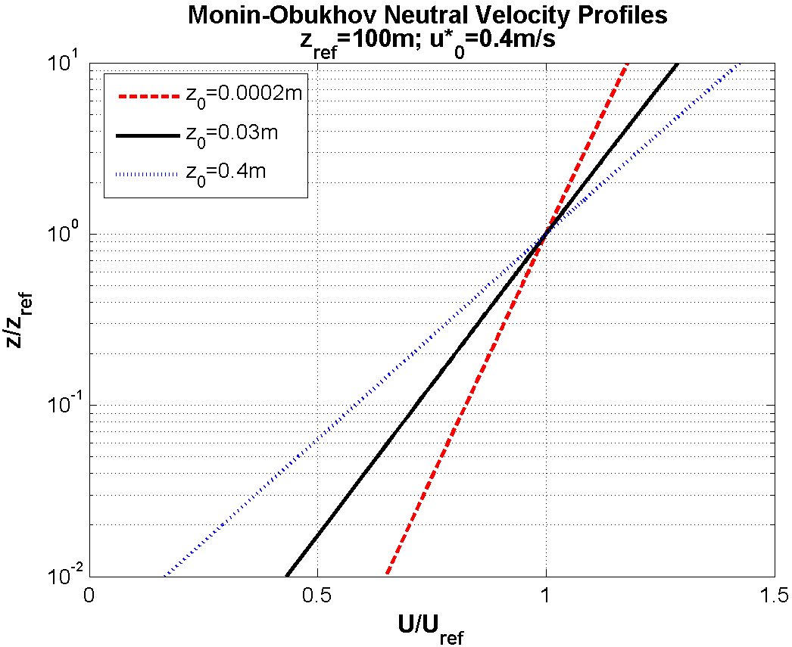
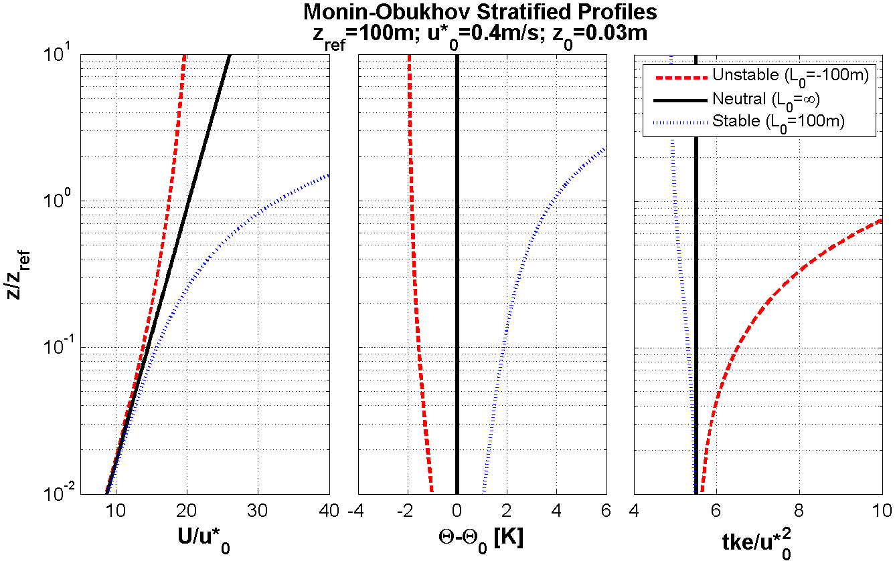

Monin Obukhov Similarity Theory (MOST)
======================================

Status
~~~~~~
.. admonition:: June 2014

   The MOST benchmark was developed in Wakebench Phase 1. The results were presented at the Torque 2014 conference.

	   * `Input/verification data <https://doi.org/10.5281/zenodo.4088315>`_ :cite:`javier_sanz_rodrigo_input_2012`
	   * `Presentation <https://doi.org/10.5281/zenodo.4088287>`_ :cite:`rodrigo_presentation_torque_2014`
	   * `Paper <https://iopscience.iop.org/article/10.1088/1742-6596/524/1/012105>`_ :cite:`rodrigo_task31_2014`

   **Highlights**

   Participants show good match with MOST at rotor heights (:numref:`fig-MOST-neutral-run1`). Next to the wall some deviations occur in one :math:`k-\epsilon` model due to a too large first-cell height. The LES model is not designed to run under surface layer conditions and show decreasing *tke* with height typical of ABL models.

	.. _fig-MOST-neutral-run1:
	.. figure:: ../../_static/windconditions/benchmarks/MOST_neutral_run1.png
	    :width: 600
	    :align: center

	    Results for neutral offshore-like conditions for non-dimensional wind speed, turbulent kinetic energy and wind shear. `© Author(s) 2014. CC BY 3.0 License <https://iopscience.iop.org/article/10.1088/1742-6596/524/1/012105>`_. Used with permission. :cite:`rodrigo_task31_2014`  

Background
~~~~~~~~~~
Monin Obukhov similarity theory (MOST) :cite:`MOST_1954` sets the point of departure of modern micrometeorology :cite:`foken_50_2006`. It is valid in the surface layer, i.e. approximately in the first 10% of the ABL, where Coriolis effects are negligible compared to friction, and under stationary and horizontally homogeneous conditions with no radiation. In these ideal conditions the vertical variations of wind direction, shear stress, heat and moisture fluxes are constant. MOST states that any dimensionless turbulence characteristic will only depend on a reduced set of scales. In addition to friction velocity (:math:`u_*`) and the height above the ground (:math:`z`), as basic scales in neutral conditions, the surface (virtual) potential temperature :math:`\Theta_0` and kinematic heat flux (:math:`\overline{\omega\theta}`) are also required in thermally stratified conditions. The Obukhov length scale :math:`L` is made of a combination of these parameters,

.. math:: L = -\frac{u_{*}^{3}}{\kappa \frac{g}{\Theta_0} \overline{\omega\theta}}

where :math:`g` is the gravity and :math:`\kappa` is the von Karman constant. A dimensionless height :math:`\zeta = z/L` is used as stability parameter (:math:`\zeta < 0` for unstable, :math:`\zeta > 0` for stable and :math:`\zeta = 0` for neutral conditions). Any dimensionless turbulent characteristic will depend solely on this parameter. By integration of the velocity and potential temperature gradients, well-known logarithmic profiles are obtained:

.. math:: U = \frac{u_*}{\kappa} \left[log \left(\frac{z}{z_0}\right) - \Psi_m \left(\frac{z}{L}\right)  \right]

.. math:: \Theta = \Theta_0 + \frac{\Theta_*}{\kappa} \left[log \left(\frac{z}{z_{0t}}\right) - \Psi_h \left(\frac{z}{L}\right)  \right];  \Theta_* = \frac{\overline{\omega\theta}}{u_*}

.. math:: k = \frac{u_*^2}{C_{\mu}^{1/2}} \left(\frac{\phi_m \left(\frac{z}{L}\right)}{\phi_{\epsilon} \left(\frac{z}{L}\right)} \right)^2

where :math:`U` is the mean velocity at height :math:`z`, :math:`z_0` and :math:`z_{0t}` are the roughness length for momentum and heat, :math:`k` is the turbulent kinetic energy, :math:`\epsilon` is the turbulent dissipation rate, :math:`\Theta_*` is a temperature scale,:math:`\Theta` is the mean (virtual) potential temperature at height :math:`z`, :math:`C_{mu}` is a constant, and :math:`\phi_x` and :math:`\psi_x` are stability functions obtained from flux-profile experiments in flat terrain, e.g. :cite:`panofsky_dutton_1984`: 

.. math:: \phi_m = \begin{cases} \left(1-16\zeta\right)^{-1/4} & \zeta \le 0 \\ 1+5\zeta & \zeta > 0 \end{cases}; \phi_h = \begin{cases} \left(1-16\zeta\right)^{-1/2} & \zeta \le 0 \\ 1+5\zeta & \zeta > 0 \end{cases}; \phi_{\epsilon} = \begin{cases} \left(1-\zeta\right)^{-1/2} & \zeta \le 0 \\ \phi_m - \zeta & \zeta > 0 \end{cases}

.. math:: \psi_m = \begin{cases} log\left[ \left(\frac{1+x^2}{2}\right)\left(\frac{1+x^2}{2}\right)^2 \right] - 2atan(x) + \frac{\pi}{2} & \zeta \le 0 \\ -5\zeta & \zeta > 0 \end{cases}; x = \left(1-16\zeta \right)^{1/4}

.. math:: \psi_h = \begin{cases} 2log\left[ \frac{1}{2} \left(1 + (1-16\zeta)^{1/2}\right) \right] & \zeta \le 0 \\ -5\zeta & \zeta > 0 \end{cases}

MOST is used to design wind engineering surface layer models. When an empty domain is simulated in steady-state and homogeneous surface conditions the flow should produce the fully-developed log-profiles predicted by the theory. These are the conditions that will be simulated in this test case.

This verification test was followed by Richards and Hoxey (1983) :cite:`richards_appropriate_1993`, who calibrated the RANS :math:`k-\epsilon` turbulence model by enforcing consistency with MOST in the surface layer in neutral conditions. Similarly, Alinot and Masson (2005) :cite:`alinot_k_2005` followed the same approach to derive consistency conditions for a :math:`k-\epsilon` model in stratified conditions.

Scope and Objectives
~~~~~~~~~~~~~~~~~~~~
This verification benchmark is intended for anyone using surface layer models as a precursor to any other validation case since it enables fundamental physics in flat terrain conditions. Simulations of homogeneous profiles in an empty domain is also performed to verify the equilibrium of the wall functions with the turbulent flow model :cite:`blocken_cfd_2007`. 

The objectives of the benchmark are:

* Demonstrate that the flow model, when running in MOST conditions, is able to reproduce the analytical profiles of the theory in neutral and stratified conditions.
* Verify that wall boundary conditions are in equilibrium with the turbulence model for a range of surface roughness conditions.

Input data 
~~~~~~~~~~
The following cases are considered:

**Neutral case:**

* Roughness length: :math:`z_0 = \left[ 0.0002, 0.03, 0.4 \right] m`
* Obukhov length: :math:`L = \infty`

.. _fig-MOST-neutral:

    MOST neutral velocity profiles.

**Stratified case:**

* Roughness length: :math:`z_0 = 0.03 m`
* Obukhov length: :math:`L = \left[ -100, \infty, 100 \right] m`

.. _fig-MOST-stratified:

    MOST stratified profiles.

Please use dry air with a density :math:`\rho = 1.225 kg m^{-3}` and dynamic viscosity :math:`\mu = 1.73e-5 kg m^{-1} s^{-1}`. The von Karman constant is :math:`\kappa = 0.4`.

Input profiles can be found in this data repository: :cite:`javier_sanz_rodrigo_input_2012`

Verification data
~~~~~~~~~~~~~~~~~
The verification data consist on the MOST analytical functions.

Model runs
~~~~~~~~~~
An empty domain of 3x0.5x0.5 km (x,y,z) dimensions should be simulated with three different values of roughness length in the ground wall.

**Neutral case:**

* *Run 1*: :math:`z0 = 0.0002 m`, typical of offshore conditions
* *Run 2*: :math:`z0 = 0.03 m`, typical of open fields with low vegetation
* *Run 3*: :math:`z0 = 0.4 m`, typical of forested terrain

**Stratified case:**

* *Run 1*: :math:`L = -100 m`, for unstable conditions equivalent to a kinematic heat flux of :math:`\overline{\omega\theta} = 0.047 mKs^{-1}`
* *Run 2*: :math:`L = \infty`, for neutral conditions
* *Run 3*: :math:`L = 100 m`, for stable conditions equivalent to a kinematic heat flux of :math:`\overline{\omega\theta} = 0.047 mKs^{-1}`

The origin of the coordinate system will be placed in the middle of the bottom edge of the inlet wall. The modeler is free to configure the computational grid according to own criteria. 

Output data
~~~~~~~~~~~
Please provide output vertical profiles of mean velocity :math:`U`, potential temperature :math:`\Theta` and turbulent kinetic energy :math:`k` at the outlet (*x* = 3000 m, *y* = 0) using the file naming and format convention described in the Windbench user's guide with profID = outlet# (# is the run number = [1,2,3]). Mention the friction velocity :math:`u_*` used in the study since this input will be used to normalize the results.

Remarks
~~~~~~~
Please describe in detail the way stratification is handled by the model in terms of stability functions, boundary conditions, contributions to turbulence equations, etc. 

References 
~~~~~~~~~~
.. bibliography:: MOST_references.bib
   :all:

