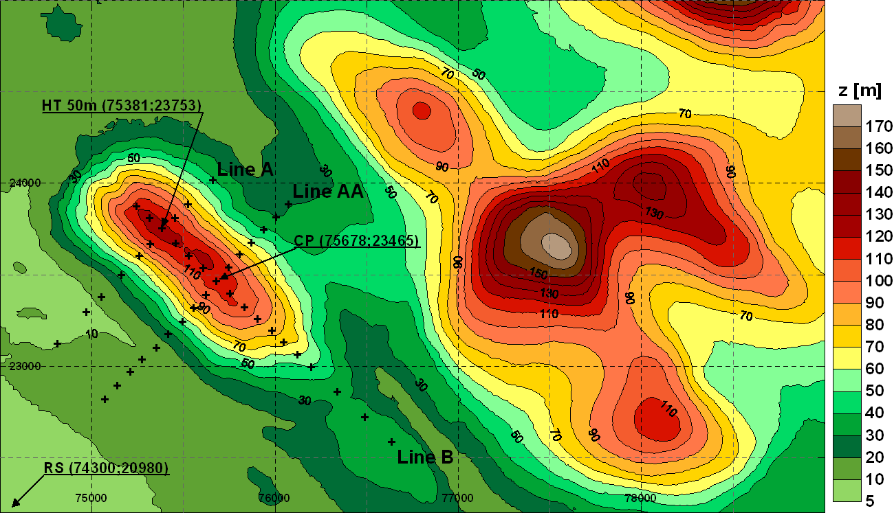

The Askervein Isolated Smooth Hill (Askervein)
==============================================

Status
------
.. admonition:: June 2014

   The Askervein benchmark was developed in Wakebench Phase 1. The results were presented at the Torque 2014 conference. 

	   * `Input and validation data <https://zenodo.org/record/4095052>`_ :cite:`javier_sanz_rodrigo_input_2014`
	   * `Presentation <https://doi.org/10.5281/zenodo.4088287>`_ :cite:`rodrigo_presentation_task31_torque_2014`
	   * `Paper <https://iopscience.iop.org/article/10.1088/1742-6596/524/1/012105>`_ :cite:`rodrigo_task31_torque_2014`

   **Highlights**

   :numref:`fig-askervein-profiles` shows the results of two RANS simulations with similar performance. While the mean flow is well reproduced, the *tke* is underestimated at the lee side of the hill. This deficiency is attributed to the limited capability of isotropic turbulence models in wake flows as much better agreement is found with LES models :cite:`silva_lopes_simulation_2007`.

	.. _fig-askervein-profiles:
	.. figure:: ../../_static/windconditions/benchmarks/askervein_profiles.png
	    :width: 600
	    :align: center

	    Horizontal profiles of fractional speed-up ratio and turbulent kinetic energy along the A and AA transects. `© Author(s) 2014. CC BY 3.0 License <https://iopscience.iop.org/article/10.1088/1742-6596/524/1/012105>`_. Used with permission. :cite:`rodrigo_task31_torque_2014`   

Scope and Objectives
--------------------
The benchmark is intended for microscale models in neutral conditions. We shall focus first on the classical 210º flow case which presents a smooth transition to the hill top from relatively homogeneous inflow conditions. 

The objectives are:

* Test microscale model settings for complex terrain. 
* Evaluate turbulence models in a test site with reasonably well defined boundary conditions. 
* Quantify performance metrics for future reference.

Further analysis can follow on less ideal flow cases, namely: 

* 130º: flow along the long-axis of the hill.
* 90º: flow in the wake of other upstream hills.

Background
----------
The Askervein hill project can be considered the cornerstone of boundary layer flow over hills. It is based on two filed campaigns conducted in 1982 and 1983 on and around the Askervein hill, a 116 m high (126 m above sea level) hill on the west coast of the island of South Uist in the Outer Hebrides, Scotland (:numref:`fig-Askervein-topo`). The hill is isolated in all wind directions but the NE-E sector. To the SW there is a flat uniform fetch of 3-4 km to the coastline where there are sand dunes and low cliffs. A uniform roughness of 0.03 m is assumed all over the hill. The smooth slopes of the hill, generally less than 20% with some small areas reaching 30%, ensures fully attached flow most of the time, being a rather friendly site for flow models.

.. _fig-askervein-topo:

    Elevation map and instrument layout.

Measurement Campaign
^^^^^^^^^^^^^^^^^^^^
Over 50 towers were deployed and instrumented for wind speed and turbulence measurements. 35 of them consisted on 10 m masts, instrumented with cup anemometers only at 10m, configuring two arrays across the mayor axis of the hill (lines *A* and *AA*), in the prevailing wind direction from SW, and one array along the minor axis of the hill (line *B*). TALA kites (*TK* runs) were used during some periods to provide upstream profiles up to ~500 m. Regular AIRsonde and upper air soundings were used to define the state of the atmosphere.  In the 1983 experiment, two 50 m towers (at a reference position RS, 3 km upstream in the SSW direction, and at the hill top HT, both with cup and Gill UVW anemometers), a 30 m tower (at the base of the hill BRE), a 16 m tower at *CP'* (near *CP* with Gill and cup anemometers), and thirteen 10 m towers were instrumented for 3-component turbulence measurements. Exact tower positions are given in the ASK83 document. In addition to the anemometry, other instruments were deployed to provide background temperature, humidity, precipitation and pressure data. In particular, in the ASK83 campaign, the temperature difference between 4.9 and 16.9 m at RS was monitored in order to estimate the Richardson number.

Two field campaigns were conducted during September-October 1982 (ASK82 campaign, :cite:`taylor_askervein_1983`) and 1983 (ASK83 campaign, :cite:`taylor_askervein_1985`). The velocities from the 10 m masts were averaged over 30 min runs for selected periods, usually of 2 hr total duration, to obtain mean flow profiles (MF runs). Turbulence data were recorded for selected periods only, also processed as 30 min blocks and combined to form 2 hr runs (*TU* runs). The ASK82 campaign comprises 24 hours of moderate-to-strong surface winds from the undisturbed wind direction sectors leading to 11 MF runs. The ASK83 campaign comprises a 16-day period with a total of 44 *MF* and 19 *TU* runs, almost all in near-neutral atmosphere. Further information about the campaigns and an inventory of all the measurements are summarized by Taylor and Teunissen (1987) :cite:`taylor_askervein_1987`.

Previous Work
^^^^^^^^^^^^^
Salmon et al (1988) :cite:`salmon_askervein_1988` presented results on the variations in mean wind speed at fixed points above the ground. An analysis of the vertical profiles of mean wind and integral turbulence statistics at the reference masts is reported by Mickle et al (1988) :cite:`mickle_askervein_1988`.

Numerous papers have been published on atmospheric models of the Askervein hill test case, almost all of them dealing with the 210º wind direction case, almost aligned with lines *A* and *AA*. Walmsley and Taylor (1996) :cite:`walmsley_boundary-layer_1996` presented both numerical and wind tunnel model results in a survey of the intensive research developed in the first decade after the field campaign. Linear models as the spectral model of Beljaars et al. (1987) :cite:`beljaars_mixed_1987`, perform well in predicting the mean flow observations in the upwind slopes and at the hilltop but fail in the lee side of the hill. These difficulties were significantly overcome by introducing non-linear terms in the spectral model :cite:`xu_non-linear_1992`.

The wind tunnel results of the early studies showed an important dependency of the flow field on the model roughness: while the best agreement on the windward side and the summit of the hill were obtained with smooth models, the performance in the lee side was better with rough models. The rough physical model also provided better fit to turbulence variables.

The application of CFD models in the simulation of the Askervein hill case has been the main activity of the last two decades since the pioneering works of Raithby et al. (1987) :cite:`raithby_askervein_1987`, who simulated an isolated Askervein hill with a mesh of 20x20x19 = 7600 cells. Classical CFD-related issues have been addressed including: effect of topographic detail and domain dimensions, grid resolution, turbulence closure, and inlet and terrain boundary conditions. Kim and Patel (2000) :cite:`kim_test_2000` tested different steady RANS turbulence models and found the best performance with the RNG version of :math:`k-\epsilon`. Castro et al. (2003) :cite:`castro_simulation_2003` present the results of steady and unsteady RANS :math:`k-\epsilon` turbulence model at different grid resolutions, showing good performance in the mean flow even with coarse grids. The influence of downstream hills, for the 210º case, was also assessed concluding that their influence on the flow at the lee side of the Askervein hill was not important. Variable roughness and transient simulations presented the best results in the predictions of the unsteady flow field of the lee side of the hill. 

Undheim et al. (2006) :cite:`undheim_non-linear_2006` used a commercial CFD solver based on steady :math:`k-\epsilon` closure with Coriolis effects included. The inlet boundary conditions were defined by simulating a homogeneous 1D atmospheric boundary layer. Good performance is observed in predicting the mean flow field but, as found by previous RANS-based studies, the turbulence in the lee side of the hill is underestimated. Grid dependency simulations were conducted varying both horizontal and vertical resolution. Vertical resolution showed larger influence, particularly regarding the relation between first-cell height and wall the functions. Vertical resolution is pointed out as the key issue related to the simulation of turbulence in the wake of the hill.

Silva Lopes et al. (2007) :cite:`silva_lopes_simulation_2007` performed LES simulations of the Askervein 210º run obtaining good solution for the mean flow and better results on turbulence profiles than with RANS :math:`k-\epsilon` :cite:`castro_simulation_2003`. However grid convergence was not achieved in the lee side of the hill. Bechmann (2006) :cite:`bechmann_large-eddy_2007` also performed LES simulations of this case, using RANS in the near wall region. Compared to a full RANS simulation, the LES results showed improvement in predicting the hilltop speed-up and the turbulent kinetic energy in the lee side of the hill, where RANS showed large under-predictions.

Input Data
----------
The following input data is available:

* Digitized map covering an area of 15x19 km based on 1:25000 maps (elevation lines every 10 m). Higher resolution digitized map of 2.5x2.5 km of the Askervein hill at 1:5000 (lines every 2 m).
* Roughness map of the 15x19 km based on 1:25000 maps. Roughness levels: 0.0002 m (water bodies), 0.4 m (build-up area) and 0.03 m (background roughness).
* Coordinates of met masts along lines *A*, *AA* and *B* and at *RS*, *CP* and *HT*.
* Inlet conditions shall be based on MOST profiles fitted to RS data.

Validation Data
---------------
The validation dataset is based on ensemble mean values of:

* Fractional-Speedup-Ratio (*FSR*) and normalized added turbulent kinetic energy (*TKE*) with respect to the reference inlet position, at 10 m above ground level along mast lines *A*, *AA* and *B*.
* *FSR* and *TKE* vertical profiles at the reference (*RS*), hilltop (*HT*) and centre point (*CP*) positions

Velocity and *TKE* values will be normalized with respect to the *RS* position. The validation dataset includes measurements during the following runs :cite:`taylor_askervein_1985`):

* 210º: MF03-B (URS = 10 m/s, WDRS = 210º, Ri = 0.0116, 3 hours), MF03-C (URS = 10 m/s, WDRS = 210º, Ri = -0.0017, 1.5 hours), MF03-D (URS = 8.9 m/s, WDRS = 210º, Ri = -0.011, 3 hours), TU03_A (URS = 9.8 m/s, WDRS = 210º, Ri = -0.0038, 1 hour), TU03_B (URS = 8.9 m/s, WDRS = 210º, Ri = -0.0074, 3 hours).
* 130º: MF30-A (URS = 12 m/s, WDRS = 130º, Ri = 0.0084, 3 hours), MF30-B (URS = 12.5 m/s, WDRS = 135º, Ri = 0.0103, 7 hours), TU30-A (URS = 7.8 m/s, WDRS = 135º, Ri = 0.0005, 2 hours), TU30-B (URS = 13 m/s, WDRS = 130º, Ri = 0.0051, 2 hours)
* 90º: MF28-A (URS = 6.8 m/s, WDRS = 90º, Ri = 0.0078, 2 hours), MF28-B (URS = 6.5 m/s, WDRS = 95º, Ri = 0.0109, 2 hours), MF28-C (URS = 7.2 m/s, WDRS = 100º, Ri = 0.0133, 2 hours) and MF28-D (URS = 6.0 m/s, WDRS = 105º, Ri = 0.0167, 14 hours)

where *MF* runs corresponds to mean flow measurements, *TU* runs corresponds to turbulence runs and *TK* to TALA kite runs. Hence, the 90º case does not have turbulence data and shall be used to assess the sensitivity of the mean flow to the wind direction variability in hill-induced wake conditions.

Model Runs
----------
The following simulation runs are considered, corresponding to the different wind directions of the measurements:

* Run 1: 210º, fine-tuning
* Run 2: 130º, blind
* Run 3: 90º, blind
* Run 4: 95º, blind
* Run 5: 100º, blind
* Run 6: 105º, blind

all in neutral conditions. The computational grid should include the hills behind Askervein. A grid dependency study should be conducted in order to assess the model sensitivity to the selected grid design. This study should be described in a self-assessment report and only the outputs from final runs should be provided.

The origin of the coordinate system should be placed at the *HT* position with *X* aligned with the incoming wind direction, *Z* pointing up and *Y* perpendicular to the *XZ* plane in a right-handed system.

Output Data
-----------
The simulated validation profiles consist on horizontal profiles along lines *A*, *AA* and *B* at 10 m height above ground level and vertical profiles at *RS*, *HT* and *CP* position, of velocity components (*U,V,W*), turbulence kinetic energy (*tke*) and dissipation rate (*tdr*). The profiles should traverse the simulated domain from boundary to boundary. Hence, the required outputs are, in this order: X(m), Y(m), Z(m), U(m/s), V(m/s), W(m/s), tke(m2/s2), tdr(m2/s3). 

Use the file naming and format convention described in the Windbench user's guide with profID = prof#, where # = [A,AA,B,RS,HT,CP], i.e. 6 output files per user and model run.

Remarks
-------
The benchmark is divided in two steps:

* *Run 1*, with validation data provided together with the inputs. This simulation shall be used to fine-tune the model in order to match the validation dataset as close as possible. In order to evaluate the added value of model fine-tuning it is important that you describe how this is performed. Please report on the deviations with respect to default settings if validation data were not available a priori (blind conditions).
* *Runs 2 to 6*: Based on the model parameterization of the first run, provide simulations for the other wind directions in blind conditions. The validation data will be provided as soon as the simulation results are submitted.

There are no guidelines on the definition of the computational mesh so please describe how you integrate grid dependency in the evaluation process. Bear in mind that grid sensitivity will be direction dependent.

References 
----------
.. bibliography:: askervein_references.bib
   :all:

