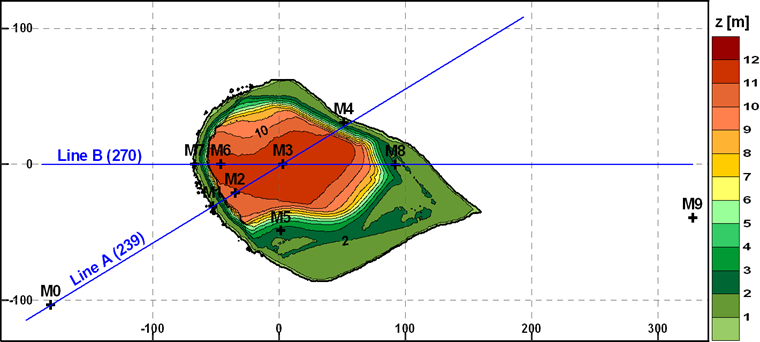

Bolund Hill
===========
.. admonition:: June 2014

   The Bolund benchmark :cite:`bechmann_bolund_2011` was revisited in Wakebench Phase 1. The results were presented at the Torque 2014 conference. 

	   * `Input and validaton data <https://www.bolund.vindenergi.dtu.dk/background>`_ :cite:`bechmann_bolund_2009` :cite:`berg_bolund_2011` :cite:`bechmann_bolund_2011` 
	   * `Presentation <https://doi.org/10.5281/zenodo.4088287>`_ :cite:`rodrigo_presentation_task31_torque_2014`
	   * `Paper <https://iopscience.iop.org/article/10.1088/1742-6596/524/1/012105>`_ :cite:`rodrigo_task31_torque_2014`

   **Highlights**

   The results are consistent with the original blind test with much better results at 5 m than at 2 m. :numref:`fig-askervein-profiles` shows mean profiles along the B5 and A5 profiles where the :math:`k-\epsilon` model shows superior performance than the :math:`k-\omega` model due to a much finer grid around the escarpment zone. 

	.. _fig-bolund-profiles:
	.. figure:: ../../_static/windconditions/benchmarks/bolund_profiles.png
	    :width: 600
	    :align: center

	    Horizontal profiles of fractional speed-up ratio and turbulent kinetic energy along the A and AA transects. `© Author(s) 2014. CC BY 3.0 License <https://iopscience.iop.org/article/10.1088/1742-6596/524/1/012105>`_. Used with permission. :cite:`rodrigo_task31_torque_2014`   

.. admonition:: December 2009
   
   The Bolund blind comparison was organized by DTU in 2009. You can find input and validation data as well as results of the blind test in project `website <https://www.bolund.vindenergi.dtu.dk/background>`_ :cite:`bechmann_bolund_2011`. 

   **Highlights**

   In total 49 different simulations were submitted, composed of 3 physical models, 9 linearized numerical models and 37 CFD models (5 LES, 7 RANS 1-equation and 25 RANS 2-equation). The physical models predicted reasonably well the mean velocity profiles but under-predicted the turbulent kinetic energy. Linear models produced the worse results as they were not capable of reproducing the flow around the steep escarpment. RANS models provided the best results although the spread of the simulations was quite big, indicating user dependencies especially regarding mesh generation. LES-based models had problems but presented promising results with regard to turbulence modelling in the flow separation area just after the escarpment. The average error in the simulation of the mean wind speeds over all the measurement locations was 13-17% in the top 10 best models. This error dropped to 4-10% if only the measurements at 5 m were considered.

Scope and Objectives
--------------------
The benchmark revisits the blind test of 2009 now allowing the participants to optimize their models to obtain the best match to the validation dataset. 

The objectives are:

* Test model fine-tuning strategies that will be applied in complex terrain sites. 
* Evaluate turbulence models in a test site with well defined boundary conditions.

Background
----------
Bolund is a 12 m high, 130 m long and 75 m wide isolated hill situated to the North of RisøDTU in Roskilde Fjord, Denmark. It is surrounded by water in all directions except to the E, where a narrow isthmus leads to the mainland. The hill is characterized by a uniform roughness of 0.015 m and surrounded by water with a roughness length of 0.0003 m. An almost vertical escarpment in the prevailing W-SW sector ensures flow separation in the windward edge resulting in a complex flow field, quite challenging for flow models.

.. _fig-bolund-topo:

    Elevation map and instrument layout.

Measurement Campaign
^^^^^^^^^^^^^^^^^^^^
The masts are positioned along two lines: A and B. Two additional masts (M0 and M9) were installed to measure the incoming undisturbed flow for westerly and easterly winds respectively. Mast M9 is placed in the coastline, where the roughness length is again 0.015 m. The masts are equipped with 23 sonic (Metek USA 1-Basic) and 12 cup anemometers (Risø Wind Sensor P2546) at heights between 2 and 15 m. 

The Bolund experiment comprises a measurement campaign of three months between 2007 and 2008 :cite:`bechmann_bolund_2009` :cite:`berg_bolund_2011`. During the measurement campaign the absolute water level was monitored, which covered the isthmus most of the time. The campaign was designed for W-SW winds where the fetch ranges 4 to 7 km, ensuring undisturbed velocity profiles over water. The E sector is more difficult to characterize due to a more the heterogeneous land cover. The prevailing stability regime was neutral to slightly stable conditions (1/L < 0.04). The data was averaged over 30 min periods.  

Previous Work
^^^^^^^^^^^^^
The original blind test after the experiment was conducted by DTU in 2009 :cite:`bechmann_bolund_2011`. Recent work on the Bolund hill include RANS simulations :cite:`prospathopoulos_application_2012`, LES simulations :cite:`diebold_flow_2013` and wind tunnel experiments :cite:`yeow_reproducing_2015` :cite:`conan_experimental_2016`.

Input Data
----------
The conditions for simulating the Bolund flow field in neutral conditions are:

* Digitized map of the Bolund hill with 25 cm resolution. Water level is set to 0.75 m.
* Roughness digitized map: hill with :math:`z_0 = 0.015 m`, water with :math:`z_0 = 0.0003 m`, coastal (X > 325 m) with :math:`z_0 = 0.015 m`.
* Inlet profiles: Measured at M0 for westerly winds and M9 for easterly winds.
* Coordinates of met masts along lines A (239º) and B (270º).
* No heat flux, gravity :math:`g = 9.81 m s^{-2}`, Coriolis parameter :math:` f_c = 1e-4 s^{-1}`.
* Obukhov length: :math:`L = \infty`.

Use dry air with a density :math:`\rho = 1.225 kg m^3` and dynamic viscosity :math:`\mu = 1.73e-5 kg m^{-1}s^{-1}`

Validation Data
---------------
The validation dataset is composed of mean flow and turbulence data from cup and sonic anemometers at 10 met masts. Ensemble averages of 10 min averaged samples within ±8º wind direction sector, with wind speeds between 5 and 12 m/s at 5 m level and under neutral conditions (:math:`|1/L| < 0.004 m^{-1}`) at the upstream masts, were used to derive the validation datasets which consists on:

* Fractional-Speedup-Ratio (*FSR*) and normalized added turbulent kinetic energy (*TKE*) with respect to the reference inlet position, at 2 and 5 m above ground level along mast lines *A* and *B*
* *FSR* and *TKE* vertical profiles at mast positions.

Velocity and *TKE* values will be normalized with the upstream friction velocity at the reference mast as in Bechmann et al. (2011). The validation dataset includes mean and standard deviation statistics from the ensemble profiles.

Model Runs
----------
The inlet profile can be based on neutral M-O log-law, defined by the following input parameters:

* Run 1: :math:`WD = 270º`, :math:`z_0 = 0.0003 m`, :math:`TKE/u_*^2 = 5.8`, :math:`u_* = 0.4 ms^{-1}`
* Run 2: :math:`WD = 255º`, :math:`z_0 = 0.0003 m`, :math:`TKE/u_*^2 = 5.8`, :math:`u_* = 0.4 ms^{-1}` 
* Run 3: :math:`WD = 239º`, :math:`z_0 = 0.0003 m`, :math:`TKE/u_*^2 = 5.8`, :math:`u_* = 0.4 ms^{-1}` 
* Run 4: :math:`WD = 90º`, :math:`z_0 = 0.015 m`, :math:`TKE/u_*^2 = 5.8`, :math:`u_* = 0.5 ms^{-1}` 

or by best fit to the measured inlet profiles (at M0 for runs 1,2 and 3 and M9 for run 4) if the participant considers that this can improve the results. The computational domain must extend at least to X = ±400 m in order to include the coastline to the East and make sure that the hill wake is completely covered. The origin of the coordinate system should be placed at M3 position with X pointing East, Y pointing North and Z pointing up. 

Output Data
-----------
The simulated validation profiles consist on horizontal profiles along lines *A* and *B* at 2 and 5 m height and vertical profiles at mast positions of velocity components (*U,V,W*), turbulence kinetic energy (*tke*), dissipation rate (*tdr*), friction velocity (*ust*) and kinematic momentum fluxes (*uu, vv, ww*). The profiles should traverse the simulated domain from boundary to boundary. Hence, the required outputs are, in this order: X(m), Y(m), Z(m), U(m/s), V(m/s), W(m/s), tke(m2/s2), tdr(m2/s3), us(m/s), uu(m2/s2), vv(m2/s2), ww(m2/s2). 

Use the file naming and format convention described in the Windbench user's guide with profID = prof#, where # = [M0,M1,M2,M3,M5,M6,M7,M8,M9,A2,A5,B2,B5], i.e. 13 output files per user and model run. Additionally, for those users that participated in the blind test of 2009, please provide the output files that were obtained at that time. This will allow an assessment of the added value of onsite measurements for model tuning. Please follow the same format described before but with a BenchmarkID = Bolund_blind2009 to differentiate between the two sets of simulations.

Remarks
-------
In order to evaluate the added value of model fine-tuning it is important that you describe how this is performed. Please report on the deviations with respect to default settings (those of the blind test). There are no guidelines on the definition of the computational mesh since this can have an important influence in the fine-tuning aspects of the model. Please describe how you integrate grid dependency in the evaluation process.

References 
----------
.. bibliography:: bolund_references.bib
   :all:

