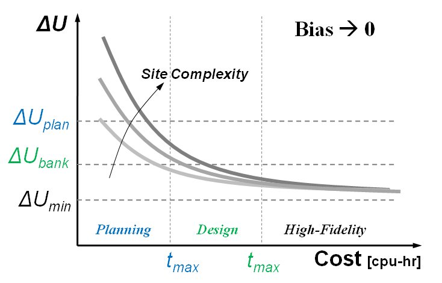
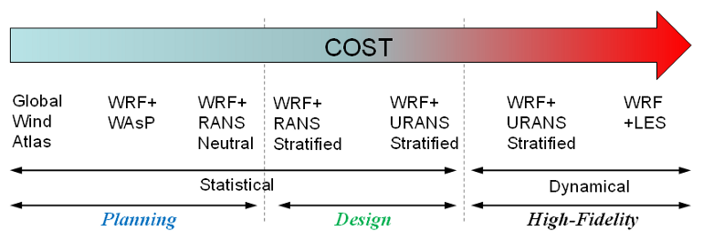

Annual Energy Yield Assessment and Wind Conditions at Cabauw (Cabauw)
=====================================================================

Status
------
.. admonition:: June 2018

   The Cabauw benchmark was organized within Wakebench Phase 2 with support from the NEWA and MesoWake EU projects. The results were presented at the Torque 2018 conference.

	   * `Observational data <https://ruisdael-observatory.nl/cesar-observatory/>`_
	   * `Simulation data <https://b2share.eudat.eu/records/87904b9740cf4defaca8a16070670ead>`_ 
	   * `Evaluation scripts <https://github.com/windbench/NEWAMesoMicroChallengePhase1>`_ 
	   * `Presentation <https://zenodo.org/record/4192667>`_ :cite:`sanz_rodrigo_newa_mesomicro_2018`
	   * `Paper <http://iopscience.iop.org/article/10.1088/1742-6596/1037/7/072030>`_ :cite:`rodrigo_comparing_2018`

   **Highlights**

   The first phase of the *NEWA Meso-Micro Challenge* was launched to establish a validation process that enables model developers to design wind resource downscaling methodologies. Initial results for the Cabauw site correspond to RANS and LES microscale ABL models coupled to mesoscale using the tendencies approach, which was previously tested in the GABLS3 benchmark :cite:`rodrigo_results_2017`. Initial results correspond to a one-year (2006) integration of the models to obtain time-series of wind conditions and annual energy production. The results show consistency at reproducing the annual wind climate distribution and mean velocity profiles. Mean turbulence profiles are also well predicted by the LES model SP-Wind which can then be used as a reference to improve RANS models. :numref:`fig-Cabuw_QoImap` shows bin-averaged quantities of interest and bias for this model. The wind resource is underestimated consistently with the input mesoscale data. It also underestimates the large wind shear and overestimate turbulence in stable conditions, probably due to the relatively coarse resolution of the model (15 m).

	.. _fig-Cabuw_QoImap:
	.. figure:: ../../_static/windconditions/benchmarks/Cabauw_SP-Wind_QoImap.png
	    :width: 600
	    :align: center

	    Heatmaps at 80 m level of observed and simulated wind conditions and AEP with SP-Wind model. `© Author(s) 2018. CC BY 3.0 License <http://iopscience.iop.org/article/10.1088/1742-6596/1037/7/072030>`_. Used with permission. :cite:`rodrigo_comparing_2018`   

Scope and Objectives
--------------------
This first phase of the *NEWA Meso-Micro Challenge* deals with two sites in horizontally homogeneous conditions:

* **Cabauw**, onshore, and
* **Fino1** offshore

In these conditions single-column models can be used cost-effectively as proxy for 3D RANS models. This will provide a more efficient approach to test statistical methodologies that can be later applied to heterogeneous sites in 3D.

The objectives of the challenge apply in this first phase as follows:

* Test meso-micro methodologies consistently for two sites and map accuracy vs cost for relevant quantities of interest, notably for annual energy production (AEP) and site suitability parameters.
* Establish open-access practices for the assessment of these methodologies that can determine the added value of meso-micro with respect to conventional methods based on microscale modeling only.
* Compare methodologies for uncertainty estimation of gross AEP and discuss their adequacy to the wind resource assessment process used by industry.

Background
----------
This challenge is organized in the context of the New European Wind Atlas (NEWA) project, whose overarching goal is to produce a seamless high resolution wind atlas for Europe. The wind atlas methodology will be based on a mesoscale to microscale (meso-micro) model-chain, validated with dedicated experiments as well as other observational databases from public and private sources. *Wind resource assessment* is related to the development of wind farms and implies the prediction of long-term wind statistics, notably the annual energy prediction (*AEP*).

In the development of meso-micro methodologies for wind resource assessment there is a tradeoff to be made between modeling fidelity and its associated cost to yield the required accuracy for the intended use (:numref:`fig-newa-mesomicro-accuracyvscost`). *Accuracy* is a qualitative concept that is used here to define the closeness of agreement between the predicted quantity of interest and the true value in the real word. Considering wind resource assessment applications, accuracy should gradually improve from the early-stage prospecting phase to the project financing phase, i.e. from *planning* to *bankable* accuracy. This process will hopefully remove the bias and reduce the uncertainty of the assessment to desired financial limits. This typically implies using off-the-shelf wind atlas products during early planning phase to design tools of increasing fidelity as the project matures. The required fidelity will depend on the complexity of the site as indicated in Figure 1 and is capped by the maximum allocated cost in terms of computing time.

.. _fig-newa-mesomicro-accuracyvscost:

    Illustration of the process of improved accuracy ΔU from planning to bankable thresholds against the maximum allocated computing time cost for different site/flow complexities.

Hierarchy of Meso-Micro Methodologies
^^^^^^^^^^^^^^^^^^^^^^^^^^^^^^^^^^^^^
A hierarchy of meso-micro methodologies for wind resource assessment is illustrated in Figure 2, ranging from the Global Wind Atlas lower-end of modeling fidelity, where the WAsP downscaling method is used directly from global reanalysis data without mesoscale modeling, to the dynamic coupling of a mesoscale model with a Computational Fluid Dynamics (CFD) model based on large-eddy simulation (LES) in the higher-end of modeling fidelity. The Weather Research and Forecasting (WRF) mesoscale model will be used in NEWA to produce the wind atlas and, therefore, it is explicitly mentioned in :numref:`fig-mesomicro-hierarchy`, also as the most popular choice for a mesoscale model. Between these limits, a hierarchy of methodologies is established depending on the type of coupling and the type of CFD model. Since the application demands statistical quantities of interest, we shall leave dynamical coupling methods out of the design tools range. In the context of NEWA, wind farm design tools will be based on statistical downscaling methodologies that combine WRF outputs with steady or unsteady Reynolds-Averaged Navier Stokes (RANS) microscale CFD model simulations that include thermal stratification.

.. _fig-mesomicro-hierarchy:

    Hierarchy of meso-micro methodologies for wind resource assessment classified in terms of the type of coupling and typical intended use.

Similarly, uncertainty quantification can also have different levels of fidelity depending on how rigorous is the analysis; from ad-hoc engineering methods to formal UQ probabilistic methods.

Input Data
----------
Input data including tendencies for Cabauw can be found in this `repository <https://b2share.eudat.eu/records/87904b9740cf4defaca8a16070670ead>`_.

**Surface roughness**

Microscale models shall consider a uniform roughness length for Cabauw of 0.15 m, as in the GABLS3 benchmark. For Fino-1, surface roughness shall depend on wind conditions through the Charnock relation, :math:`z_0 = C_{ch}u_*^2/g`, with :math:`C_{ch} = 0.0062`, calibrated in neutral conditions for year 2006 in :cite:`sanz_rodrigo_flux-profile_2011`.

**Mesoscale Forcing**

You are welcome to use your own mesoscale simulations to feed the meso-micro methodology. However, if you only plan to run microscale simulations, for consistency you should use the mesoscale input forcing provided herein.

Mesoscale input forcing in terms of mesoscale tendencies is provided for the sites following the same methodology of the GABSL3 benchmark case and described in :cite:`sanz_rodrigo_methodology_2017`. For each site, a reference WRF configuration based on one-way telescoping nests at 27, 9 and 3 km horizontal resolution, all of them with grid dimensions of 61x61 and 61 vertical levels up to 5000 Pa. The yearly period is integrated based on two-day runs with an additional day for spin-up. Simulations are initialized at 12UTC using ERA-Interim reanalysis data. The U.S. Geological Survey (USGS) land-use surface data, that comes by default with the WRF model, is used together with the unified Noah land-surface model to define the boundary conditions at the surface. Other physical parameterizations used are: the rapid radiative transfer model (RRTM), the Dudhia radiation scheme and the Yonsei University (YSU) first-order PBL scheme.

A NetCDF file for mesoscale data is provided with the following information:

* Site coordinates and Coriolis parameter
* Time-height 2D arrays of velocity components (*U, V, W*) and potential temperature (*Th*)
* Time-height 2D arrays of mesoscale forcings (tendencies): geostrophic wind (*Ug, Vg*), advective wind (*Uadv, Vadv*) and advective potential temperature (*Thadv*)
* Time array of surface-layer quantities: friction velocity (*ust*), kinematic heat flux (*wt*), 2-m temperature (*T2*), skin temperature (*TSK*), surface pressure (*Psfc*)

Units, dimensions and variables description are all provided in the NetCDF file. Momentum tendencies are provided in [m s-1] and should be multiplied by the Coriolis parameter (:math:`f_c = 0.00115 s^{-1}`) to obtain appropriate forces in [m s-2]. For convenience, we have omitted information about humidity since the assumption of dry-atmosphere is typically adopted by wind energy flow models.

**Reference Power Curve**

The NREL 5 MW reference power curve will be used to evaluate AEP :cite:`jonkman_definition_2009`. A text file is provided with other additional wind speed `relationships <https://wind.nrel.gov/forum/wind/viewtopic.php?t=363>`_ computed by NREL.

Validation Data
---------------
One year of observations from two tall masts are provided in NetCDF format:

* Cabauw: 200-m mast, year 2006 (51.971ºN, 4.927ºE)
* Fino-1: 100-m mast, year 2006 (54.0143ºN, 6.5933ºE)

The following quantities of interest will be evaluated at the three sites:

* Horizontal wind speed (*S*) and direction (*WD*) distributions at a reference hub-height of 80 m.
* *AEP_gross* (*p50, p90*) at 80 m using the NREL 5MW reference power curve.
* Velocity and turbulence intensity profiles for 16 wind direction sectors and three stability classes.

Stability will be characterized based on the local Obukhov length *L* using the stability parameter *z/L* , where *L* is obtained from sonic anemometer measurements at 3 m in Cabauw and at 40 m in Fino-1. Stability classes are defined as follows:

* Unstable (u): -20 < *z/L* < -0.2
* Weakly unstable (wu): -0.2 < *z/L* < -0.02
* Neutral (n): -0.02 < *z/L* < 0.02
* Weakly stable (ws): 0.02 < *z/L* < 0.2
* Stable (s): 0.2 < *z/L* < 20

Model Runs
----------
Consistent with the philosophy of the challenge, each participant should develop a plan to span the accuracy vs cost figure. For instance:

* A WRF modeler could run yearly simulations starting from the 3-nest configuration of the reference set-up (or a different one) and add other 3 nests switching to LES down to resolutions of the order of 100 m and provide 6 results, one from each nest, for the 3 sites.
* A CFD modeler may vary the number of simulations included in the assessment and/or decide to increase resolution or switch to a higher-fidelity turbulence model when switching from planning to design phase.

For each *AEP* assessment you should provide the cost in cpu-hr.

Also adopting the end-user perspective, the simulations may consider how to best use the onsite measurements to calibrate their model-chain to the reference mast. This is equivalent to a conventional micrositing process in the design phase of ensuring that self-prediction at the reference site is free of bias before extrapolating horizontally or vertically to other target prediction sites. Introducing calibration is clear way of distinguishing between planning and design phase in the accuracy vs cost figure although the cpu-time may be roughly the same.

For consistency with the GABLS3 benchmark, microscale models using Sogachev et al. (2012) :cite:`sogachev_consistent_2012` k-ε turbulence model shall use this set of constants: κ = 0.4, :math:`C_{ε1} = 1.52`, :math:`C_{ε2} = 1.833`, :math:`σ_k = 2.95`, :math:`σ_ε = 2.95` and :math:`C_μ = 0.03` [4].

Output Data
-----------
Data should be provided in a single NetCDF file per site, as described in the python template based on the reference WRF simulation. Following the example above, the WRF-LES approach should provide 6x2 = 12 files.

Output quantities and dimmensions:

* dimmensions: time (*t*), height above ground (*z*), *zflux* height of surface-layer quantities.
* time-height: *U*, *V* velocity components, potential temperature (*Th*), turbulent kinetic energy (*TKE*).
* time: friction velocity (*us*), kinematic heat flux (*wt*) and/or Obukhov length (*L*) at *zflux* height and 2-m temperature (*T2*).

To homogenize the output data please consider these indications:

* Time series should be provided based on 10-min or 1-hr averages.
* Vertical profiles should be provided at the simulation levels.
* A python script is provided to help you figure out the output format. Please respect the naming convention for variables to allow automatic post-processing.
* Time series: please follow the same format as the input .nc file, mean profiles will be generated in the post-processing.

References 
----------
.. bibliography:: cabauw_references.bib
   :all:

Acknowledgements
----------------
This benchmark was produced with support from the MesoWake and NEWA European projects under the umbrella of IEA-Wind Task 31 Wakebench Phase 2.
