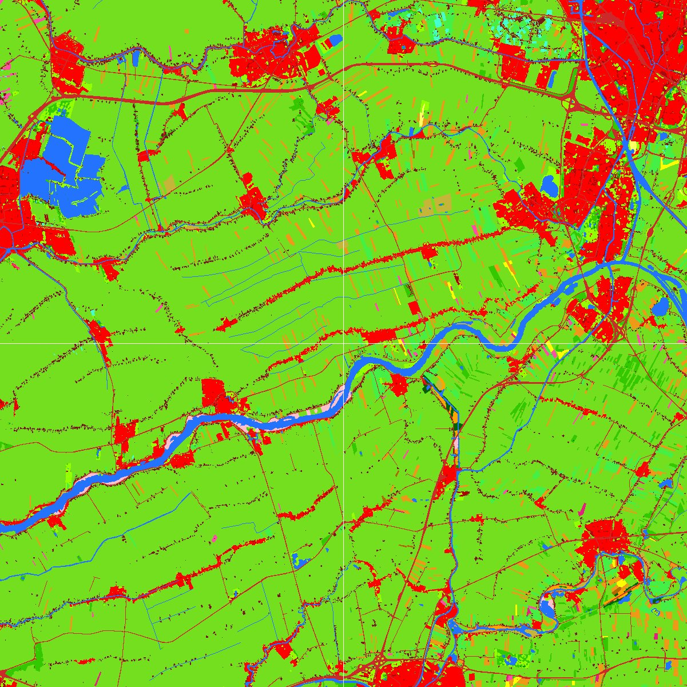

Diurnal Cycle Leading to a Nocturnal Low-Level Jet (GABLS3)
===========================================================

Status
------
.. admonition:: June 2017

   The GABLS3 benchmark was organized within Wakebench Phase 2 with support from the NEWA and MesoWake EU projects. The results were presented at the Wake Conference 2017.

	   * `Observational data <http://projects.knmi.nl/gabls/>`_
	   * `Simulation data <http://doi.org/10.23728/b2share.f5d5a492d8aa4b7998b70abd68f5eae4>`_ :cite:`sanz_rodrigo_gabls_2017`
	   * `Evaluation scripts <https://github.com/windbench/gabls3>`_ :cite:`pawel_gancarski_windbenchgabls3_2018`
	   * `Presentation <https://doi.org/10.5281/zenodo.4090658>`_ :cite:`sanz_rodrigo_presentation_wakeconference_2017`
	   * `Paper <http://iopscience.iop.org/article/10.1088/1742-6596/854/1/012037>`_ :cite:`rodrigo_results_2017`

   **Highlights**

   The main challenge for microscale models was to produce consistent flow fields with respect to the reference mesoscale model that was used to derive their input forcings. This consistency has been achieved by URANS and LES models. The spread of the models is significant but of similar magnitude to that shown by the ensemble of WRF simulations. Using the WRF ensemble mean leads to the best predictions of wind shear and wind veer. :numref:`fig-GABLS3_QoIs_rotor` shows the evolution of quantities of interest in the rotor area. The phase error in the input mesoscale data dominates the error at microscale that, nevertheless, are able to produce a realistic nocturnal low-level-jet. 

	.. _fig-GABLS3_QoIs_rotor:
	.. figure:: ../../_static/windconditions/benchmarks/GABLS3_QoIs_rotor.png
	    :width: 600
	    :align: center

	    Time-series of rotor-based quantities of interest used for validation. `© Author(s) 2014. CC BY 3.0 License <https://iopscience.iop.org/article/10.1088/1742-6596/854/1/012037>`_. Used with permission. :cite:`rodrigo_results_2017`   

.. admonition:: February 2017

   A sensitivity analysis on input forcings and surface boudary conditions with *CFDWind* URANS single-column model was presented at Torque 2016 and in a follow-up *Wind Energy Science* paper. 

	   * `Observational data <http://projects.knmi.nl/gabls/>`_ 
	   * `Simulation data <http://doi.org/10.23728/b2share.22e419b663cb4ffca8107391b6716c1b>`_ :cite:`sanz_rodrigo_assessment_2017`
	   * `Evaluation scripts <https://github.com/jsrodrigo/GABLS3-CFDWindSCM/tree/v1.0>`_ :cite:`sanz_rodrigo_assessment_scripts_2017`
	   * `Presentation <https://zenodo.org/record/4090868>`_ :cite:`javier_sanz_rodrigo_wind_2016`
	   * `Conference Paper <https://iopscience.iop.org/article/10.1088/1742-6596/753/3/032024>`_ :cite:`rodrigo_wind_2016`
	   * `Journal Paper <https://wes.copernicus.org/articles/2/35/2017/>`_ :cite:`sanz_rodrigo_methodology_2017`

   **Highlights**

   The added value of introducing mesoscale forcings to a single-column model is investigated by systematically removing forcing terms in the momentum and heat equation. The largest effect comes from geostrophic wind which needs to be height-dependent to track wind conditions in the upper levels of the ABL. Here it also becomes important to introduce advection tendencies which can be quite intense during low-level jet conditions. The bias in the mesoscale input forcings can be mitigated by introducing nudgging terms (:numref:`fig-GABLS3_tz_fields`). 

	.. _fig-GABLS3_tz_fields:
	.. figure:: ../../_static/windconditions/benchmarks/gabls3_cfdwind_tz.png
	    :width: 600
	    :align: center

	    Time-height countour plots of wind speed, direction and potentital temperature for WRF-YSU, :math:`k-\epsilon` model driven by WRF forcings and adding nudging in the first 200 m compared with observations. `© Author(s) 2017. CC BY 3.0 License <https://wes.copernicus.org/articles/2/35/2017/>`_. Used with permission. :cite:`sanz_rodrigo_methodology_2017`   

Scope and Objectives
--------------------
The GABLS3 case was selected in the NEWA project as a golden benchmark for the design of mesoscale-to-microscale methodologies for wind resource assessment. The case is suitable for the development of microscale wind farm models that incorporate realistic forcing, derived from a mesoscale model, along a typical diurnal case that leads to the development of a nocturnal low-level jet. GABLS1 and GABLS2 can be considered as precursor cases dealing with turbulence modelling of the atmospheric boundary layer under idealized forcing conditions. These cases are suitable for the design of RANS-based single-column models by comparison with LES simulations, that have shown high consistency :cite:`svensson_evaluation_2011`:cite:`baas_how_2010`:cite:`sanz_rodrigo_methodology_2017`. 

Challenges of the GABLS3 case include: incorporating time- and height-dependent mesoscale forcing in microscale models, turbulence modeling at varying atmospheric stability conditions, defining suitable surface boundary conditions for momentum and heat and characterization of the wind profile in (non-logarithmic) LLJ conditions.  

Wind-energy specific objectives of the benchmark include:

* Demonstrate the capability of wind energy ABL models to incorporate realistic mesoscale forcing
* Implement surface boundary conditions suitable for wind assessment studies using mesoscale simulation data and/or observations (typical of wind energy campaigns)
* Develop suitable model calibration strategies for wind energy applications or, in other words, how to best use available measurements (typical of wind energy campaigns) to correct meso-micro predictions
* Define suitable metrics for validation of ABL models based on wind energy quantities of interest

By "typical wind energy campaigns" we would like to encourage modellers to prioritize observations that are common place in wind resource assessment campaigns (80 masts with velocity and temperature measurements, lidar profilers measuring up to 400 m). 

Background
----------
The GEWEX Atmospheric Boundary Layer Study (GABLS) series of benchmarks were developed by the boundary-layer meteorology community to improve the representation of the atmospheric boundary layer in regional and large-scale atmospheric models. The model intercomparison studies have been organized for single-column models (SCM) and large-eddy simulation models (LES). The cases are based on observations over flat terrain in the Artic, Kansas (USA), Cabauw (The Netherlands) and Dome C (Antarctica).

GABLS1 simulated a quasi-steady stable boundary layer resulting from 9 hours of uniform surface cooling :cite:`holtslag_preface_2006`:cite:`cuxart_single-column_2006`:cite:`svensson_evaluation_2011`. GABLS2 simulated a diurnal cycle, still with idealized forcing, by simplifying measurements from the CASES-99 experiment in Kansas :cite:`kumar_impact_2010`:cite:`baas_how_2010`. GABLS3 simulated a real diurnal case with a strong nocturnal low-level jet (LLJ) at the Cabauw met tower in the Netherlands :cite:`holtslag_introduction_2014`:cite:`bosveld_third_2014a`:cite:`bosveld_third_2014b`:cite:`basu_gabls3-les_2012`:cite:`holtslag_stable_2013`. In GABLS4, the aim is to study the interaction of a boundary layer with strong stability in relatively simple surface coupling characteristics.

The challenges of stable boundary layers and diurnal cycles are reviewed by Hotlslag et al. (2013) :cite:`holtslag_stable_2013`, notably: the relation between enhanced mixing in operational weather models performance, investigate the role of land-surface heterogeneity in the coupling with the atmosphere, develop LES models with interactive land-surface schemes, create a climatology of boundary-layer parameters (stability classes, boundary-layer depth, and surface fluxes) and develop parameterizations for the very stable boundary layer when turbulence is not the dominant driver. These challenges are ultimately shared by wind energy applications that are embeded in atmospheric models.

Site Description
^^^^^^^^^^^^^^^^
The GABLS3 set-up is described in Bosveld et al. (2014) :cite:`bosveld_third_2014a`. The case analyzes the period from 12:00 UTC 1 July to 12:00 UTC 2 July 2006, at the KNMI-Cabauw Experimental Site for Atmospheric Research (`CESAR <https://ruisdael-observatory.nl/cesar-database/>`_), located in the Netherlands (51.971ºN, 4.927ºE), with a distance of 50 km to the North Sea at the WNW direction [12]. The elevation of the site is approximately -0.7 m, surrounded by relatively flat terrain characterized by grassland, fields and some scattered tree lines and villages (:numref:`fig-Cabauw-landuse`). The mesoscale roughness length for the sector of interest (60º - 120º) is 15 cm.

.. _fig-Cabauw-landuse:

    Land-use map of a 30x30 km area around the Cabauw site (figure from `KNMI <http://projects.knmi.nl/hydra/index.html>`_'s HYDRA project website)

Measurement Campaign and Case Selection
^^^^^^^^^^^^^^^^^^^^^^^^^^^^^^^^^^^^^^^
The CESAR measurements are carried out at a 200-m tower, free of obstacles up to a few hundred meters in all directions. The measurements include 10-min averaged vertical profiles of wind speed, wind direction, temperature and humidity at heights 10, 20, 40, 80, 140 and 200 m, as well as surface radiation and energy budgets. Turbulence fluxes are also monitored at four heights: 3, 60, 100 and 180 m. A RASS profiler measures wind speed, wind direction and virtual temperature above 200 m.

The selection criteria for GABLS3 consisted on the following filters applied to a database of 6 years (2001 - 2006): stationary synoptic conditions, clear skies (net longwave cooling > 30 W/m² at night), no fog, moderate geostrophic winds (5 to 19 m/s, with less than 3 m/s variation at night) and small thermal advective tendencies. Out of the 9 diurnal cycles resulting from this filtering process, the one that seemed more suitable was finally selected: 12:00 UTC 1 July to 12:00 UTC 2 July 2006.

More information about the case background and set-up can be found in the official `GABLS3 <http://projects.knmi.nl/gabls/index.html>`_ website

Input Data 
----------
The case set-up and input data of the original GABLS3 case can be found in the KNMI website. This is usefull if you want to compare with published results of the original SCM model intercomparison. In the original GABLS3 set-up, the simulated mesoscale tendencies are adjusted to produce a better match with the surface geostrophic wind obtained from a network of synoptic stations and the wind speed at 200-m measured at the Cabauw tower. Initial profiles are based on soundings measured near the Cabauw mast.

Alternatively, you can use inputs generated entirely from a WRF simulation, as described in :cite:`javier_sanz_rodrigo_wind_2016`:cite:`sanz_rodrigo_methodology_2017`. Here, instead of using observed initial projiles and adjusted mesoscale forcings you can use initial profiles and forcing produced directly from a mesoscale simulation. This is more representative of a wind energy model-chain set-up, where the inputs of a microscale model are generated by a "wind atlas" methodology that doesn't normally include corrections with local measurements. Instead, local adjustments are allowed at the microscale level by incorporating onsite measurements as if these measurements were part of a typical wind resource assessment campaign.    

The WRF simulation is based on a one-way nesting configuration of three concentric square domains centered at the Cabauw site, of the same size 181x181, and at 9, 3 and 1 km horizontal resolution. The vertical grid, approximately 13 km high, is based on 46 terrain-following (eta) levels with 24 levels in the first 1000 m, the first level at approximately 13 m, a uniform spacing of 25 m over the first 300 m and then stretched to a uniform resolution of 600 m in the upper part. The U.S. Geological Survey (USGS) land-use surface data, that comes by default with the WRF model, is used together with the unified Noah land-surface model to define the boundary conditions at the surface. Other physical parameterizations used are: the rapid radiative transfer model (RRTM), the Dudhia radiation scheme and the Yonsei University (YSU) first-order PBL scheme. The simulation uses input data from ERA-Interim with a spin-up time of 24 hours. The WRF set-up follows the reference configuration of Kleczek et al (2014) :cite:`kleczek_evaluation_2014`, who run a sensitivity analysis of WRF showing reasonably good results at reproducing the nocturnal LLJ.

A NetCDF file is provided with the following information:

* Site coordinates and Coriolis parameter
* Time-height 2D arrays of velocity components (*U,V,W*) and potential temperature (*Th*)
* Time-height 2D arrays of mesoscale forcings (tendencies): geostrophic wind (*Ug*, *Vg*), advective wind (*Uadv*, *Vadv*) and advective potential temperature (*Thadv*)
* Time array of surface-layer quantities: friction velocity (*ust*), kinematic heat flux (*wt*), 2-m temperature (*T2*), skin temperature (*TSK*), surface pressure (*Psfc*)

Units, dimmensions and variables description are all provided in the NetCDF file. Momentum tendencies (:numref:`fig-gabls3-tendencies`) should be multiplied by the Coriolis parameter to obtain appropriate forces in [m/s]. For convenience, we have ommitted information about humidity since the assumption of dry-atmosphere is typically adopted by wind energy flow models.

.. _fig-gabls3-tendencies:
.. figure:: ../../_static/windconditions/benchmarks/gabls3_tendencies.png
    :width: 600
    :align: center

    Time-height contour plots of the longitudinal wind component U and momentum budget terms: Utend = Uadv + Ucor + Upg + Upbl. [1][2]

A python script is provided to show how to read the NetCDF input file and extract these variables.

Validation Data
---------------
The following quantities of interest (QoI) will be evaluated as described in :cite:`javier_sanz_rodrigo_wind_2016`:cite:`sanz_rodrigo_methodology_2017`, using a reference rotor size of 160 m diameter at a hub-height of 120 m (~ 7 MW turbine):

* Rotor equivalent wind speed (*REWS*)
* Hub-height wind direction (*WDhub*)
* Turbulence intensity at hub-height (*TIhub*)
* Wind shear (power-law exponent *α*) and wind veer (slope of linear fit to wind direction differences *ψ*) accross the rotor plane
* Surface-layer quantitites: *T2*, *ust*, *wt* and *z/L*

The evaluation consists on time-series plots of these QoIs along the diurnal cycle and mean-absolute error (*MAE*) integrated over the whole cycle. 

Model Runs
----------
The benchmark is mainly developed for microscale models that make use of the input data described above. However, mesoscale or multi-scale (online meso-micro) simulations are also welcome. The following suggestions are provided to guide the model runs:

* We shall use the 2-m temperature (*T2*) as our most practical reference to deduce the potential temperature surface boundary conditions using Monin Obukhov similarity theory, since this variable is routinely measured in measurement campaigns and is part of the standard output of meteorological models.    
* Simulations may be based entirely on the mesoscale input data or incorporate measurements from the Cabauw mast. Priority should be given to measurements that can be found in "typical wind energy campaigns" (80 masts with velocity and temperature measurements, lidar profilers measuring up to 400 m).
* Sensitivity analysis of mesoscale models can be used to quantify the input uncertainty derived from the spread of the ensemble of simulations. 
* Online multi-scale simulations models can be used as a reference for microscale models that are coupled to mesoscale asyncronously through the input data. To allow this comparison multi-scale simulations should be also run with ERA-Interim input data.  
* Microscale models using Sogachev et al. (2012) :cite:`sogachev_consistent_2012` :math:`k-\epsilon` turbulence model shall use this set of constants: :math:`κ = 0.4`, :math:`C_{ε1} = 1.52`, :math:`C_{ε2} = 1.833`, :math:`σ_k = 2.95`, :math:`σ_ε = 2.95` and :math:`C_μ = 0.03` 

If resources allow, please use a spin-up time of 24 hours as in the input data.

Output Data
-----------
Data should be provided in a single NetCDF file as described in the python template. The following output variables are requested:

* Time-height 2D arrays of: velocity components, potential temperature and turbulent kinetic energy
* Time 1D array of surface-layer quantities: friction velocity (*ust*, at 3 m), kinematic heat flux (*wt*, at 3 m) and 2-m temperature (*T2*)
* Time in hours since 2006-07-01 12:00 UTC
* Heights in meters (please provide model levels at least up to 4000 m)

References 
----------
.. bibliography:: gabls3_references.bib
   :all:

Acknowledgements
----------------
This benchmark was produced with support from the MesoWake and NEWA European projects under the umbrella of IEA-Wind Task 31 Wakebench Phase 2.

