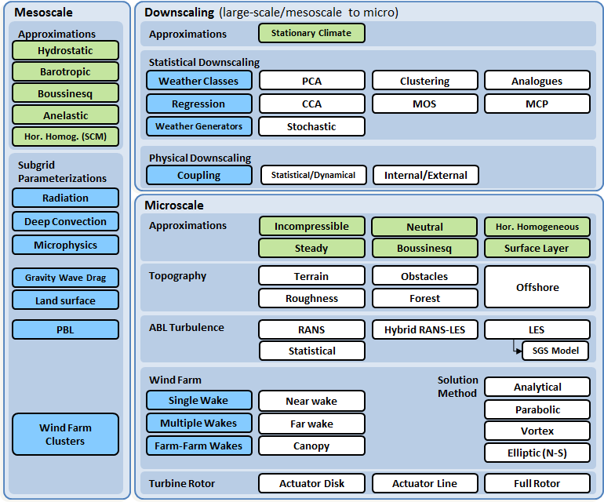

Applications
============
Energy Yield Assessment and Site Suitability
~~~~~~~~~~~~~~~~~~~~~~~~~~~~~~~~~~~~~~~~~~~~~
The planning phase of wind assessment spans a period of several years from site prospecting to wind farm design and financing. Quantities of interest (QoI) during this are mainly: 
•	Long-term wind resource and wind farm annual energy production (AEP) including wake losses and associated uncertainties, relevant for wind mapping, energy yield assessment and project financing
•	50-year recurrent 10-min-averaged extreme wind speed, effective (background and wake-added) turbulence intensity at hub-height, inflow angle (angle off the horizontal plane at which the mean wind flow comes into the rotor) at hub-height and wind shear (vertical velocity gradient) and wind veer (vertical wind direction gradient) across the rotor span. These variables are relevant for site suitability studies following the standards of the International Electrotechnical Commission (IEC) regarding wind turbine design aspects (IEC, 2005). 
Conventional wind farm design is driven by site suitability and optimization based on AEP. In contrast, an integrated design approach will optimize based on minimizing the lifetime levelized cost of energy (LCOE), defined as the capital (CAPEX) and operational (OPEX) costs divided by the energy yield (EWEA, 2009). Project financing costs contributing to the CAPEX are associated to uncertainties in the long-term predictability of AEP. Hale (2015) provides a couple of examples about the impact of bias and uncertainty in AEP for a 200 MW project. A 3% bias on the p50 (50% exceedance probability) of AEP means $17MM difference in the net project value, whereas a 1.5% difference on p95 (uncertainty) results in $1.5M difference on the net project value. These deviations are representative of the variability on AEP estimates faced by the wind industry and show how sensitive project financing is to relatively small changes in the AEP assessment. 
Baily (2015) publishes mean values of energy losses (19.7%) and uncertainties (7.5%) for North American wind farms. The largest contributors to project underperformance are factors that depend on the quality of the flow model like wake losses, long-term extrapolation, and horizontal and vertical extrapolation of measured wind resource.

* Discuss IEC 61400-15 context (industry perspective)
* Add IEC definitions of variables with equations
* Uncertainty quantification (IEC categories)
* Impact of bias and uncertainty: Quality acceptance criteria

Numerical Site Calibration
~~~~~~~~~~~~~~~~~~~~~~~~~~
- IEC 61400-12-4
- Scope and Objectives
- Quantities of Interest
- Impact of bias and uncertainty: Quality acceptance criteria

The Multi-Scale Model-Chain
===========================
Sanz Rodrigo et al. (2016a) provide a review of mesoscale-to-microscale wind farm flow models, their categorization considering typical meteorological and wind energy terminology and an overview of validation cases that form the basis for the Wakebench V&V framework. A very superficial summary of the model-chain is introduced here as well.   
Turbines extending more than 200 m in height and wind farms extending for tens of kilometers challenge traditional hypothesis for wind farm design based on Monin Obukhov similarity theory (MOST) modeling at microscale, i.e. under a uniform geostrophic forcing across the area of interest (Monin and Obukhov, 1959). Such large turbines span a significant part of the atmospheric boundary layer (ABL), especially in stable conditions where the boundary layer height is of the order of a few hundred meters (Krogsæter and Reuder, 2015). 
Modeling the ABL requires including Coriolis forces and thermal stratification (so called atmospheric stability). Free-atmosphere conditions also become more relevant, as upper boundaries of the wind farm (microscale) computational domain, to limit the growth of the incoming ABL and its interaction with the internal boundary layer that develops within the wind farm and downstream (Porté-Agel et al., 2015).  
A more realistic representation of the atmospheric boundary layer at microscale becomes more amenable to coupling with mesoscale models using statistical or physical downscaling methods. This introduces mesoscale forcing (also called tendencies) as opposed to using stationary forcing in the idealized microscale model set-up. Mesoscale tendencies are not only relevant to study more realistic transient phenomena, like ramp events, low-level jets, etc., but also to link the local wind conditions with the long-term climatology to derive the AEP of a wind farm (Petersen and Troen, 2012).   

.. image:: figures/model-chain.png
	:width: 600 

Figure 1: Model-chain for wind farm flow modeling. Reprinted with permission from Sanz Rodrigo et al. (2016a).

Figure 1 and Figure 2 summarize with block diagrams the model-chain for wind farm flow models from global to turbine scale (Sanz Rodrigo et al., 2016a). Each scale has different applications and quantities of interest, determining the orientation of the model evaluation strategy. As in the physical space, models are interrelated and they differentiate based on the underlying assumptions. In general, more drastic assumptions are adopted when moving into the design space, where computational efficiency is a major constraint. For instance most of the wind farm wake models, used by industry to design large offshore wind farms, are still based on analytic steady-state models (for instance: Aislie (1988) or Katic et al. (1986)), since they can provide a reasonably good prediction of the aggregated wind farm array efficiency. These models have been calibrated with observations and are robust and computationally cheap. However, their performance at individual turbine level or under stable inflow conditions is poor and this prevents using them for advanced design optimization (Peña et al, 2013).
High-fidelity models (HFM) can also be used to verify and, eventually, calibrate engineering models provided they have qualified for doing so based on their validation track record. In terms of turbulence modeling, the highest fidelity level of practical use is large-eddy simulation (LES), able to resolve the energy-containing scales while modeling subgrid scales (for instance, 	Jimenez et al, (2007), Churchfield et al. (2012), Wu et al. (2011)). An intermediate range between analytic and LES models corresponds to Reynolds-Averaged Navier Stokes (RANS) models that simulate turbulence in terms of bulk quantities that they model with transport equations coupled to the momentum and energy equations (for instance, Sogachev et al., (2012), Palma et al. (2008), Cabezón et al. (2011)).  

Figure 2: Categorization of model building-blocks based scales, their approximations, sub-grid parameterizations and solution methods. Reprinted with permission from Sanz Rodrigo et al. (2016).        

Similar to LES models, meteorological models, either global or regional (limited-area), use semi-empirical parameterizations to model subgrid-scale processes. Mesoscale models physically downscale global input data at a horizontal resolution of tens of kilometers to scales of the order of 1 km using nesting or other grid refinement methods (Skamarock et al., 2008). Mesoscale models are used in forecasting mode to produce short-term predictions of the weather from a few hours to a few days (Giebel et al., 2011). In hindcast (historical integration) mode, mesoscale models are integrated over a decade or more years using global reanalysis data to characterize the long-term wind climate and create regional wind atlases for spatial planning applications (Hahmann et al., 2015). Regional wind atlases can also be generated by sampling a number of representative days from the reanalysis database whose statistical significance is almost the same as that obtained from a full integration (Rife et al., 2013).
Coupling mesoscale and microscale can be done dynamically (also called physical), statistically or by combination of both. The range of scales between the cut-off frequencies of mesoscale and microscale models is called terra incognita due to the lack of appropriate subgrid turbulence closures in the mesoscale part (Wyngaard, 2004). Statistical downscaling from meteorological model outputs to mast measurements using, for example, regression techniques is a common method in wind energy to extrapolate short resource assessment measurement campaigns to a 20-year equivalent wind farm lifetime (Zhang, 2015). Dynamic coupling can be done online by switching off the boundary-layer parameterization and introducing LES to resolve scales from several hundred of meters to a few meters (Mirocha et al., 2014). It can also be done offline by adapting mesoscale model outputs, like mesoscale tendencies, to feed microscale boundary conditions (Sanz Rodrigo et al., 2017a). "Adapting" means avoid double counting by filtering out microscale processes that where already accounted for by the mesoscale model parameterizations. This is also the philosophy behind the generalized wind climate approach that allows to statistically downscale the wind climate by first removing local effects or upscaling the mesoscale outputs (Badger et al., 2014). 
While meso-micro coupling techniques have already proved successful at downscaling mean flow characteristics, it still remains a big challenge to properly cascade turbulence through the terra incognita (Muñoz-Esparza, 2014).  

PIRT Gap Analysis
=================

References
==========
.. 
   .. bibliography:: references.bib
   		:all:

