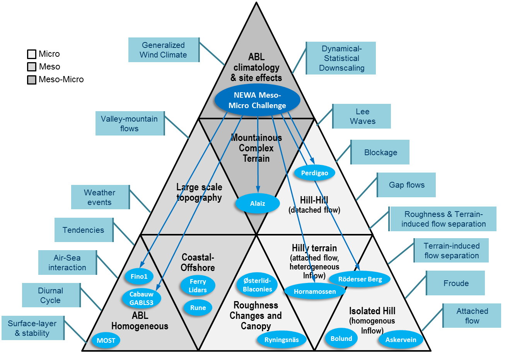

Wind Conditions 
===============

Wind conditions is a generic term to refer to atmospheric flow quantities that affect wind turbine and wind farm performance in terms of energy production and structural integrity. This is the context for the application of atmospheric flow models in activities such as wind resource and energy yield assessment, wind turbine site suitability and wind farm design, during the planning phase, and weather and wind power forecasting during the operational phase of the wind farm. The IEA-Wind TCP Task 31 `Wakebench <https://community.ieawind.org/task31/home>`_ is focused on the planning phase while `Task 36 <https://www.ieawindforecasting.dk/>`_ is dealing with wind power forecasting. We shall focus on the wind farm system, considering all the mesoscale-to-microscale weather and turbulence processes, which are relevant for inflow and wind farm wake propagation and interaction.   

Intended Use
------------
Assessment of Wind Resource, Energy Yield and Turbine Suitability
^^^^^^^^^^^^^^^^^^^^^^^^^^^^^^^^^^^^^^^^^^^^^^^^^^^^^^^^^^^^^^^^^
The assessment of the long-term wind resource, energy yield and turbine site suitability is addressed by the IEC 61400-15 [ref], providing a framework for reporting and uncertainty quantification. This standard complements IEC 61400-1 and 61400-3 in the definition of site specific wind conditions. We shall use the definitions provided therein on relevant quantities of interest, representative of the design lifetime and defined at hub-height (:math:`z_{hub}`) unless otherwise stated:

* *Annual average wind speed at hub height* (:math:`V_{ave}`): wind speed averaged according to the definition of *annual average*, i.e. mean value of a set of measured data of sufficient size and duration to serve as an estimate of the expected value of the quantity. The averaging time interval shall be a whole number of years to average out non-stationary effects such as seasonality.  

* *Annual wind speed frequency distribution* (:math:`f_{i,j}`): Annual distribution of wind speeds as a function of wind direction *i* and/or wind speeds *j*.

* *Weibull distribution*: The probability distribution function used to describe the distribution of wind speeds over a period of one year, defined in terms of the scale parameter (:math:`C`) and shape parameter :math:`k`.

  .. math:: P_w(V) = 1 - exp\left[-(V/C)^k\right]

* *Annual energy production* (:math:`AEP`): total amount of electrical energy produced by the Wind Turbine Generator System (WTGS), estimated by integrating the power curve with the wind speed frequency distribution and multiplying by the number of hours in a year. 

  .. math:: AEP = T\sum_{i,j} P(V_j)f_{i,j}

  where :math:`P(V_j)` is the power curve at wind speed :math:`V_j` and :math:`T` = 8760 h. 

* *Annual capacity factor* (:math:`CF`): the ratio between the AEP and the maximum possible annual energy output.    

  .. math:: CF = \frac{AEP}{N_tP_{rated}T}

  where :math:`N_t` is the number of turbines and :math:`P_{rated}` is the WTGS rated power.

* *Reference wind speed* (:math:`V_{ref}`): basic parameter for wind speed used for defining WTGS classes. A turbine designed for a WTGS class with a reference wind speed :math:`V_{ref}`, is designed to withstand climates for which the extreme 10 min average wind speed with a recurrence period of 50 years at turbine hub-height is lower than or equal to :math:`V_{ref}`.  

* *Annual average flow inclination angle* (:math:`\phi`): The flow inclination is defined as the angle between a horizontal plane and the wind velocity vector at hub height: 

  .. math:: \phi = tan^{-1}\left(V_z/V_{xy}\right) 

  where :math:`V_{xy}` and :math:`V_{z}` are the horizontal and vertical components of the wind speed. The flow inclination angle is positive if the wind velocity vector is pointing upwards. The annual average shall be taken as the energy weighted mean from all directions.

* *Mean turbulence intensity* (:math:`I`): the ratio of the wind speed standard deviation to the mean wind speed determined from the same set of measured wind speed data and taken over a period of 10 minutes and a minimum sampling frequency of 5 seconds.

  .. math:: I = \frac{\sigma_V}{V}

* *Standard deviation of turbulence intensity* (:math:`\sigma_{I}`): The standard deviation of a sub set of the turbulence intensities (:math:`I`). The sub set typically represents a bin within a wind speed- wind direction matrix.

* *Average turbulence intensity at 15m/s* (:math:`I_{15}`): Mean turbulence intensity over all wind directions in 15m/s wind speed bin.

* *Extreme ambient turbulence intensity*: Extreme value of the ambient turbulence intensity with a return period of 50 years as a function of wind speed.   

* *Mean wind shear* (:math:`\alpha`): Wind shear, i.e. the variation of wind speed across a plane perpendicular to the wind direction, (or power law) exponent.

  .. math:: V(z) = V(z_r)\left(\frac{z}{z_r}\right)^{\alpha}

The IEC 61400-15 standard provides a framework for the categorization of energy production losses and uncertainties. We shall focus on those related to the flow model, namely:

It is defined in terms of the median (:math:`P50`), representing an excedence probability of 50%, and the standard deviation (:math:`\sigma_{AEP}`) as a measure of uncertainty.

* *   

.. todo:: Define end-user requirements explicitely. 

   * Discuss IEC 61400-15 context (industry perspective)
   * Add definitions of quantities of interest including uncertainty quantification categories
   * Impact of bias and uncertainty: set quality acceptance criteria

Numerical Site Calibration
^^^^^^^^^^^^^^^^^^^^^^^^^^
.. todo:: Define end-user requirements explicitely. 

   * Discuss IEC 61400-12-4 context 
   * Scope and Objectives
   * Definitions of Quantities of Interest
   * Impact of bias and uncertainty: set quality acceptance criteria

The Multi-Scale Model-Chain
---------------------------
Sanz Rodrigo et al. (2016) provide a review of mesoscale-to-microscale wind farm flow models of different fidelity levels considering meteorological and wind energy terminology. Each scale has different applications and quantities of interest, determining the orientation of the model evaluation strategy (:numref:`fig-model-chain`). 

.. _fig-model-chain:
.. figure:: figures/model-chain.png
    :width: 600
    :align: center

    Model-chain for wind farm flow modeling (Sanz Rodrigo et al., 2016).

A mind map elaborated during IEA-Task 31 Phase 3 shows the relationships between model building-blocks at different scales, input quantities and phenomena of interest for the intended use of these models (:numref:`fig-windconditions-mindmap`). 

.. _fig-windconditions-mindmap:
.. figure:: mindmap/map.svg
    :width: 600
    :align: center

    Mind map of multi-scale models and phenomena of interest for wind conditions.
    `Interactive mind map <../../../windconditions/mindmap/index.html>`_  

The mind map breaks down the full complexity of atmospheric models into three scales:

1. **Global**: drives wind climate variability from seasons to decades at horizontal scales of tens of kilometers. Global reanalyses are typically used to characterize this variability and serve as input boundary condtions for mesoscale models. 
2. **Mesoscale**: drives weather processes at regional level down to scales of the order of 1 km. Relevant mesoscale phenomena include: horizontal wind speed gradients due large-scale topography, land-sea transitions and farm-farm effect, low-level jets during stable conditions, etc. Outputs from mesoscale models provide forcing for microscale models in the form of virtual masts, generalized wind climates, lateral boundary conditions or volumetric forzes (tendencies). 
3. **Microscale**: drives turbulence and speed-up effects at site level at scales down to a few meters. Site effects depend on local changes in elevation and roughness, the presence of obstacles and forest canopies as well as thermal stratification across the atmospheric boundary-layer (ABL). Microscale effects are particularly important in complex terrain where relevant phenomena develop such as: flow separation and recirculation, gravity waves, gap flows, hydraulic jump, mountain-valley winds, etc. 

Validation Strategy
-------------------
The main objective of the New European Wind Atlas (NEWA) project was to introduce a new methodology for the assessment of wind conditions based on a mesoscale to microscale model-chain approach (Sanz Rodrigo et al., 2019). This *NEWA Meso-Micro Challenge* had two applications in mind: 

* **Wind atlas for regional planning**: the main focus was at the mesoscale model, to come up with a reference set-up of the Weather Research and Forecasting (WRF) model that can be used seamlessly across Europe. Throgh sensitivity analysis, the most suitable configuration was selected to produce a 30-year long simulation forced by ERA5 reanalysis data. Then, this long-term wind climate was statistically downscaled to 50 m using the WAsP methodology. The validation strategy was based on a database of 291 meteorological masts, at least 40 m tall, made available by Vestas [12]. The main objective of the validation campaign was to determine the general quality of the wind atlas categorized by regions and terrain complexity. A one year multi-physics ensemble run was also used to quantify the spread of mesoscale winds that would be translate into input uncertainty for microscale models.       
* **Site assessment**: here the main focus was at the microscale model, to develop suitable mesoscale forcing and surface boundary conditions for both Reynolds-Averaged Navier Stokes (RANS) and Large-Eddy Simulation (LES) turbulence models. The validation strategy was based on detailed experiments that capture the changes on mean flow and turbulence characteristics over a wide range of siting conditions.      

Experiments 
-----------
In addition to tall towers for boundary-layer measurements of at least one year duration, NEWA experiments made extensive use of remote sensing and, in particular, scanning lidar systems to obtain unprecedented measurements of the flow field during intensive campaigns of several months [7]. A summary of NEWA experiments and other sources of open-access validation data used in the project are provided in :numref:`tab-NEWA-experiments`. 

.. _tab-NEWA-experiments:
.. csv-table:: Summary of NEWA experiments and other sources of open-access wind conditions datasets (Sanz Rodrigo et al., 2019)
   :header: "Experiment", "Location", "Site", "Description", "References"
   :widths: 10, 5, 10, 30, 5

   Cabauw/  GABLS3,Netherlands,Onshore flat terrain,200-m tall mast for atmospheric boundary-layer research in horizontally homogeneous conditions,"[20], [21], [22], [23], [24], [25]"
   Satellite SAR,Global,Offshore surface,Satellite SAR wind data archive from 2002,"[26], [27]"
   WISED,Europe,Onshore surface,Wind Surface European Database comprising quality-controlled data from 15000+ stations,[12]
   Ryningsnäs,Sweden,Forested simple terrain,200-m tall mast in a patchy forested site in simple terrain conditions,"[28], [29], [30], [31], [32]"
   RUNE,Denmark,Near-shore,"Near-shore wind resource from 8 lidars, one ocean buoy and satelite data",[33]
   Ferry Lidar,Baltic Sea,Offshore,Offshore wind resource from a ferry-mounted profiling lidar along the South Baltic Sea from Kiel (Germany) to Klaipeda (Lithuania),"[34], [35]"
   Østerild Balconies,Denmark,Forested flat terrain,2 horizontally scanning Doppler lidars measuring at 50 and 200 m above patchy forest,[36]
   Rödeser Berg,Germany,Forested hill,"200-m tall forested hill equipped with a 200-m mast at the hill top, a 140-m mast at the inflow and scanning Doppler lidars mapping a transect along the prevailing wind direction","[37], [8], [35]"
   Hornamossen,Sweden,Forested rolling hills,10-km long transect consisting of 9 remote sensing profilers and one 180-m flux-profile mast in forested and moderately complex terrain,"[35], [7]"
   Perdigão ,Portugal,Double ridge,"50 masts, 20 scanning lidars, 7 profiling lidars and other meteorological equipment distributed along and across two parallel steep ridges","[38], [39], [40]"
   Alaiz (ALEX17),Spain,Ridge-valley-mountain,"5 scanning Doppler lidars measuring a Z-shaped 10-km long transect along the ridge tops and the across the valley together with a windRASS profiler, 7 tall masts and 10 surface stations","[41], [42], [43]"

:numref:`fig-NEWA-building-blocks` shows how the experiments complement existing campaigns and each other to cover a wide range of wind conditions, from homogeneous conditions onshore (e.g. Cabauw), to offshore (e.g. Fino1) and coastal (Ferry Lidar, RUNE), to forested landscapes (Ryningsnäs, Balconies, Hornamossen), to flow over hills (Askervein, Bolund, Rödeser Berg), to steep (Perdigão) and mountainous terrain (Alaiz) [6]. 

.. _fig-NEWA-building-blocks:

    NEWA validation building-blocks and phenomena of interest for wind conditions (Sanz Rodrigo et al., 2019).

Phenomena of Interest 
---------------------
.. todo:: Most recent PIRT addressing relevent phenomena for wind conditions. 

   * List of physical phenomena providing definitions and references 
   * PIRT table from MMC

.. _fig-Perdigao:
.. figure:: figures/Perdigao.jpeg
    :width: 600
    :align: center

    Phenomena of interest in the Perdigão experiment. Re-posted with permission from the AMS (`Fernando et al., 2019 <https://journals.ametsoc.org/doi/full/10.1175/BAMS-D-17-0227.1>`_)

Benchmarks
----------

The Homogeneous ABL
^^^^^^^^^^^^^^^^^^^
The ABL building-block of :numref:`fig-ABL-building-block` deals with the horizontally homogeneous atmospheric boundary-layer. A hierarchy of verification and validation cases is suggested to progressively incorporate essential physics, namely:

1. Monin-Obukhov similarity theory (MOST) for surface-layer steady-state conditions depending on roughness and stability (Monin and Obukhov, 1954). 
2. Leipzig wind profile in neutral steady-state conditions (Lettau, 1950).
3. GABLS1 quasi-steady stable boundary-layer under uniform geostrophic wind and surface cooling (Cuxart et al., 2006). 
4. GABLS2 diurnal cycle under uniform geostrophic wind and varying surface temperature (Svensson et al., 2011).
5. GABLS3 diurnal cycle under realistic mesoscale forcing and varying surface boundary conditions (Bosveld et al., 2014a). 
6. Cabauw annual integration of the wind climate to predict quantities of interest for the intended use: wind resource assessment and turbine siting.

.. _fig-ABL-building-block:
.. figure:: figures/ABL-building-block.png
    :width: 600
    :align: center

    V&V hierarchy for the ABL building-block.

Benchmarks for MOST and Leipzig were conducted during Wakebench Phase 1 (Sanz Rodrigo et al, 2014). The GEWEX Atmospheric Boundary Layer Studies (GABLS), developed by the boundary-layer meteorology community (Holtslag et al., 2013), and adopted for wind energy applications by focusing the evaluation on rotor-based quantities of interest (Sanz Rodrigo et al., 2017a). The GABLS3 and Cabauw benchmarks were conducted in Wakebench Phase 2 (Sanz Rodrigo et al., 2017b; Sanz Rodrigo et al., 2018). A brief summary of these benchmarks is provided here as a demonstration of the V&V framework.

.. toctree::
   :glob:
   :maxdepth: 1

   benchmarks/moninobukhov.rst
   benchmarks/leipzig.rst
   benchmarks/gabls/gabls3.rst

Coastal-Offshore
^^^^^^^^^^^^^^^^

.. todo:: Introduce phenomena you could find in these benchmarks. 

   * Ferry-Lidars
   * Rune 

Forest Canopy
^^^^^^^^^^^^^
.. todo:: Introduce phenomena you could find in these benchmarks. 

   * Ryningsnäs: flat terrain 200-m met mast
   * Osterlid-Balconies: flat terrain horizontal scanning lidar
   * Hornamossen: forested hills

Hills 
^^^^^
.. todo:: Introduce phenomena you could find in these benchmarks. 

   * Askervein: smooth hill
   * Bolund: small-scale escarpment
   * Rödeser Berg: forested hill

.. toctree::
   :glob:
   :maxdepth: 1

   benchmarks/askervein.rst
   benchmarks/bolund.rst

Complex Terrain 
^^^^^^^^^^^^^^^
.. todo:: Introduce phenomena you could find in these benchmarks. 

   * Perdigao: double-hill
   * Alaiz: mountain-valley-ridge

Wind Resource Assessment and Site Suitability 
^^^^^^^^^^^^^^^^^^^^^^^^^^^^^^^^^^^^^^^^^^^^^
.. todo:: wrapping up flow models to provide QoIs for WRA and Site Suitability 

   * NEWA Challenge

.. toctree::
   :glob:
   :maxdepth: 1

   benchmarks/gabls/gabls.rst
   benchmarks/mesomicrochallenge.rst

Numerical Site Calibration
^^^^^^^^^^^^^^^^^^^^^^^^^^
.. todo:: wrapping up flow models to provide QoIs for WRA and Site Suitability 

   * Alaiz site calibration campaign

References
----------
.. 
   .. bibliography:: references.bib
         :all:
