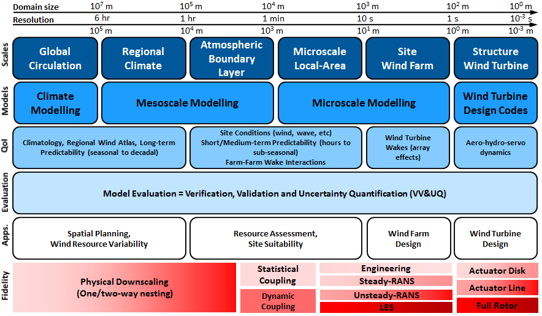
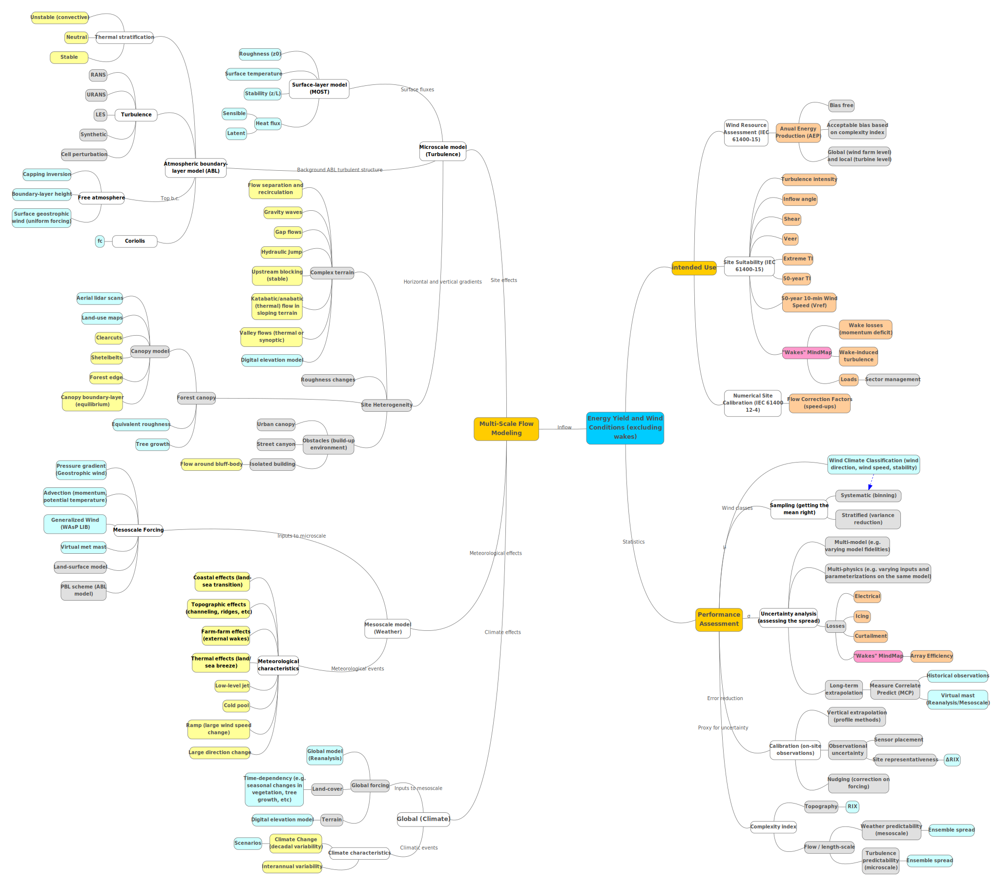
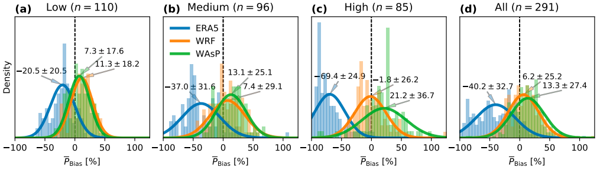
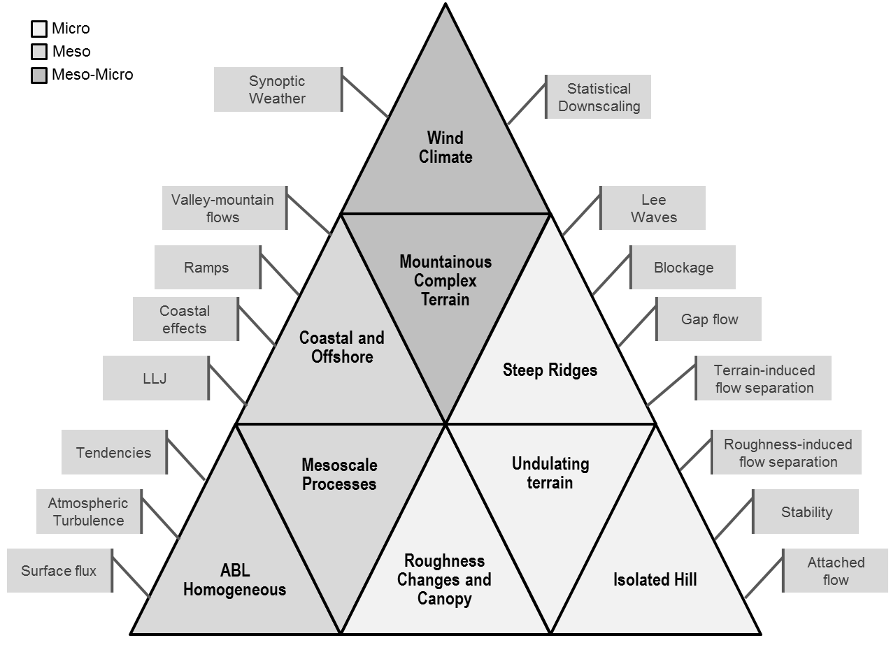
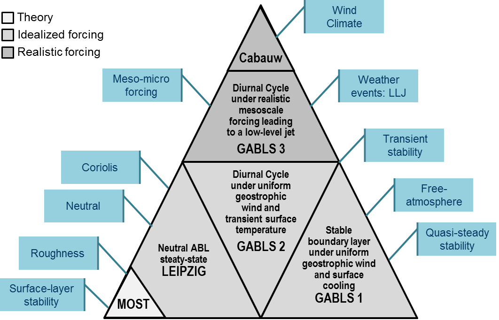

Wind Conditions 
===============

Wind conditions is a generic term to refer to atmospheric flow quantities that affect wind turbine and wind farm performance in terms of energy production and structural integrity. This is the context for the application of atmospheric flow models in activities such as wind resource and energy yield assessment, wind turbine site suitability and wind farm design, during the planning phase, and weather and wind power forecasting during the operational phase of the wind farm. The IEA-Wind TCP Task 31 `Wakebench <https://community.ieawind.org/task31/home>`_ is focused on the planning phase while `Task 36 <https://www.ieawindforecasting.dk/>`_ is dealing with wind power forecasting. The model evaluation framework shall focus on the wind farm system, considering all the mesoscale-to-microscale weather and turbulence processes, which are relevant for inflow and wind farm wake propagation and interaction.   

Intended Use
------------

Assessment of Wind Resource, Energy Yield and Turbine Suitability
^^^^^^^^^^^^^^^^^^^^^^^^^^^^^^^^^^^^^^^^^^^^^^^^^^^^^^^^^^^^^^^^^
The assessment of the long-term wind resource, energy yield and turbine site suitability is addressed by the `IEC 61400-15 working group <https://www.iec.ch/dyn/www/f?p=103:14:13217413763586::::FSP_ORG_ID:10314>`_ by providing a framework for assessment and reporting. Two standards result from this group: 

* The IEC 61400-15-1 complements IEC 61400-1 and 61400-3 in the reporting of site specific wind conditions and related atmospheric variables. 
* The IEC 61400-15-2 addresses the asessment and reporting of wind resource and energy yield.

Whenever possible we shall use the definitions provided therein on relevant quantities of interest for flow model evaluation. The variables are integrated with a wind speed distribution that is representative of the design lifetime and they are defined at hub-height (:math:`z_{hub}`) unless otherwise stated.

.. note:: 
   As of June 2020, the IEC 61400-15 standards are in draft form.  

Wind Resource
"""""""""""""
* *Annual average wind speed at hub height* (:math:`V_{ave}`): wind speed averaged according to the definition of *annual average*, i.e. mean value of a set of measured data of sufficient size and duration to serve as an estimate of the expected value of the quantity. The averaging time interval shall be a whole number of years to average out non-stationary effects such as seasonality.  

* *Annual wind speed frequency distribution* (:math:`f_{i,j}`): Annual distribution of wind speeds as a function of wind direction *i* and/or wind speeds *j*. Wind speed is classified using 1 m/s bins and wind direction sectors are no wider than :math:`30^{\circ}`. Additional dimmensions related to turbulence characteristics like stability, turbulence intensity or wind shear could be used for additional granularity in the distribution.  

* *Weibull distribution*: The probability distribution function used to describe the distribution of wind speeds over a period of one year, defined in terms of the scale parameter (:math:`C`) and shape parameter :math:`k`.

  .. math:: P_w(V) = 1 - exp\left[-(V/C)^k\right]

Energy Yield
""""""""""""
* *Gross annual energy production* (:math:`AEP_{gross}`): total amount of electrical energy produced by the Wind Turbine Generator System (WTGS), estimated by integrating the power curve with the wind speed frequency distribution and multiplying by the number of hours in a year. For a wind farm:

  .. math:: AEP_{gross} = T\sum_{i,j,k} P_k(V_j) f_{i,j,k}

  where :math:`f_{i,j,k}` is the annual wind speed frequency distribution at each turbine site *k*, :math:`P_k(V_j)` is the power curve of each turbine at wind speed :math:`V_j` and :math:`T` = 8760 h is the number of hours in a year. The gross AEP is also defined as the AEP at a reference site, typically a meteorological mast, vertically extrapolated to hub-height and horizontally extrapolated to the turbine sites. This extrapolation is carried out by profile methods and flow models that predict speed-up effects due to terrain elevation and roughness changes, forest canopies and obstacles. 

* *(Net) Annual energy production* (:math:`AEP`): total amount of electrical energy delivered at the grid connection point after deducing all the energy losses that take place in the wind farm. 

  .. math:: AEP = AEP_{gross} - AEP_{gross}\prod_{l} \eta_{l} 

  where :math:`\eta_{l}` is the *efficiency* corresponding to the loss category *l* as per the IEC 61400-15, namely: electrical, availability, wake effect, curtailment, environmental and turbine performance. Each category includes a number of subcategories. For instance, wake losses are subdivided into internal (interarray effects), external (current farm-farm effects) and future (prospect farm-farm effects) wake losses. Internal wake losses are predicted by wake models to obtain the, so-called, *array efficiency*:

  .. math:: \eta_{wake} = \frac{P_{wake}}{P_{gross}} = \frac{\sum_{i,j,k} Pw_k(V_j) f_{i,j,k}} {\sum_{i,j,k} P_k(V_j)f_{i,j,k}}

  where the efficiency is defined in terms of a power ratio with :math:`Pw_k` being the power output predicted by the wake model at each turbine position *k*.

* *Annual capacity factor* (:math:`CF`): the ratio between the AEP and the maximum possible annual energy output, an ideal case where all turbines would be producing at rated power throughout the year.    

  .. math:: CF = \frac{AEP}{T\sum_{k} Prated_k}

  where :math:`Prated_k` is the rated power of each turbine. Alternatively, wind farm performance is defined in terms of the *annual equivalent hours* of the wind farm operating at rated power, i.e. :math:`AEH = CF \cdot T`

Site Suitability
""""""""""""""""
* *Extreme wind speed with a recurrence interval of 50 years* (:math:`V_{50}`): Also called *reference wind speed* (:math:`V_{ref}`) in the IEC 61400-1 standard to define WTGS classes. A turbine designed for a WTGS class with a reference wind speed :math:`V_{ref}`, is designed to withstand climates for which the extreme 10 min average wind speed with a recurrence period of 50 years at turbine hub-height is lower than or equal to :math:`V_{ref}`.  

* *Annual average flow inclination angle* (:math:`\phi`): The flow inclination is defined as the angle between a horizontal plane and the wind velocity vector at hub height: 

  .. math:: \phi = tan^{-1}\left(V_z/V_{xy}\right) 

  where :math:`V_{xy}` and :math:`V_{z}` are the horizontal and vertical components of the wind speed. The flow inclination angle is positive if the wind velocity vector is pointing upwards. The annual average shall be taken as the energy weighted mean from all directions.

* *Mean turbulence intensity* (:math:`I`): the ratio of the wind speed standard deviation to the mean wind speed determined from the same set of measured wind speed data and taken over a period of 10 minutes and a minimum sampling frequency of 5 seconds.

  .. math:: I = \frac{\sigma_V}{V}

* *Standard deviation of turbulence intensity* (:math:`\sigma_{I}`): The standard deviation of a sub set of the turbulence intensities (:math:`I`). The sub set typically represents a bin within a wind speed- wind direction matrix.

* *Average turbulence intensity at 15m/s* (:math:`I_{15}`): Mean turbulence intensity over all wind directions in 15m/s wind speed bin.

* *Extreme ambient turbulence intensity*: Extreme value of the ambient turbulence intensity with a return period of 50 years as a function of wind speed.   

* *Mean wind shear* (:math:`\alpha`): Wind shear, i.e. the variation of wind speed across a plane perpendicular to the wind direction, (or power law) exponent.

  .. math:: V(z) = V(z_r)\left(\frac{z}{z_r}\right)^{\alpha}

AEP Prediction Bias and Uncertainty Quantification
""""""""""""""""""""""""""""""""""""""""""""""""""
The pre-construction energy yield assessment process will output a distribution of AEP defined in terms of the median :math:`P50`, where the actual AEP would be exceeded 50% of the time, and a standard deviation :math:`\sigma_{AEP}` as a measure of the AEP *uncertainty*. Then, the *prediction bias* is the difference between the estimated *P50* and the actual AEP

.. math:: BIAS_{AEP} = AEP_{true} - AEP_{P50} 

While each quantity of interest can be subject to uncertainty quantification individually, the main focus of the IEC 61400-15-2 standard is to predict the overall energy production uncertainty since this is directly connected to the financial performance of a wind project. This overall uncertainty is broken down into categories and subcategories by the standard to provide a common framework for the wind industry. Lee and Fields (2020) :cite:`lee_overview_2020` provide a review of energy yield assessment prediction bias, losses and uncertainties following this framework. The review shows that while there has been a tendency towards the overestimation of P50, this has been progressively corrected and we are now approaching zero bias on average. The estimated mean AEP uncertainty remains at over 6% implying that there is room for improvement. Indeed, changing the uncertainty by 1% can lead to 3-5% change in the net present value of a wind farm :cite:`lee_overview_2020`.     

Numerical Site Calibration
^^^^^^^^^^^^^^^^^^^^^^^^^^
.. todo:: Define end-user requirements explicitely. 

   * Discuss IEC 61400-12-4 context 
   * Scope and Objectives
   * Definitions of Quantities of Interest
   * Impact of bias and uncertainty: set quality acceptance criteria

Multi-Scale Modeling of Wind Conditions
---------------------------------------
Sanz Rodrigo et al. (2016) :cite:`rodrigo_mesoscale_2017` provide a review of mesoscale-to-microscale wind farm flow models of different fidelity levels considering meteorological and wind energy terminology. Each scale has different applications and quantities of interest, which will determine the orientation of the model evaluation strategy (:numref:`fig-model-chain`). 

.. _fig-model-chain:

    Model-chain for wind farm flow modeling. `© 2016 John Wiley & Sons, Ltd <https://onlinelibrary.wiley.com/doi/pdf/10.1002/wene.214>`_. Used with permission. :cite:`rodrigo_mesoscale_2017`

Models can be coupled together to form a multi-scale modeling system where, for instance, the microscale sub-system (the wind farm) uses input data generated by the mesoscale sub-system to characterize the long-term wind climate distribution that modulates the local wind conditions. Similarly, an aerolastic model of the turbine sub-system can be used to predict detailed rotor aerodynamics responsible for wake generation in the wind farm wake model. A mind map elaborated during IEA-Task 31 Phase 3 shows the relationships between model building-blocks at different scales, input quantities and phenomena of interest for the intended use of these models (:numref:`fig-windconditions-mindmap`). 

.. _fig-windconditions-mindmap:

    Mind map of multi-scale models and phenomena of interest for wind conditions.
    `Interactive mind map </windconditions/mindmap/index.html>`_  

The mind map breaks down the full complexity of atmospheric models into three scales:

1. **Global**: drives wind climate variability from seasons to decades at horizontal scales of tens of kilometers. Global reanalyses are typically used to characterize this variability and serve as input boundary condtions for mesoscale models. 
2. **Mesoscale**: drives weather processes at regional level down to scales of the order of 1 km. Relevant mesoscale phenomena include: horizontal wind speed (gross AEP) gradients due large-scale topography, land-sea transitions and farm-farm (external wake) effect, low-level jets producing large wind shear during stable conditions, etc. Mesoscale models provide forcing for microscale models in the form of virtual masts, generalized wind climates, lateral boundary conditions or volumetric forzes (also called tendencies).  
3. **Microscale**: drives turbulence and speed-up effects at site level at scales down to a few meters. Site effects depend on local changes in elevation and roughness, the presence of obstacles and forest canopies as well as thermal stratification across the atmospheric boundary-layer (ABL). Microscale effects are particularly important in complex terrain where relevant phenomena develop such as: flow separation and recirculation, gravity waves, gap flow, hydraulic jump, mountain-valley winds, etc. At microscale, wind farm wake models are embedded in atmospheric flow models to simulate internal wake effects that determine array efficiency. 

Wake models are described in detail in the :ref:`Multi-Scale Wind Farm Modeling` section to simulate external and internal wake effects (array efficiency) and wind turbine loads. 

Validation Strategy
-------------------
Following the model evaluation process of :numref:`fig-ambidextrous-process`, a validation strategy for wind conditions requires the provision of high-fidelity experiments targeting high-impact phenomena of interest, to validate the capacity of the flow model to deal with relevant physics, as well as long-term wind resource campaigns to demonstrate the added value that resolving these phenomena brings to the applications of interest. These applications typically involve integrating a discrete number of flow model simulations with an statistical methodology (a design tool) that provides the expected long-term mean or extreme values and the associated uncertainties. This should be done for a wide variety of wind climates and siting conditions to cover the widest operational range possible. 

This validation strategy was implemented in the New European Wind Atlas (NEWA) project towards the development of a new methodology for the assessment of wind conditions that is based on a mesoscale to microscale model-chain approach (Sanz Rodrigo et al., 2020) :cite:`rodrigo_new_2020`. The scope of the project was focused on wind conditions for wind resource and site assessment, i.e. without the influence of wind turbines. Therefore, the model-chain was devoted to atmospheric flow models with two applications in mind:

* **Wind atlas for regional planning**: the main focus was on the mesoscale model, to come up with a reference set-up of the Weather Research and Forecasting (WRF) model that could be used seamlessly across Europe. Through sensitivity analysis, the most suitable configuration was selected to produce a 30-year long simulation forced by ERA5 reanalysis data (Hahmann et al. 2020) :cite:`hahmann_making_2020`. Then, this long-term wind climate was statistically downscaled to 50 m using the WAsP methodology. Hence, the wind atlas model-chain consists on physical downscaling down to 3 km resolution, to produce long-term time series of mesoscale wind characteristics, whose long-term wind climate distributions are then used as input data for a microscale model to produce high-resolution wind resource quantities. The validation strategy was based on a database of 291 meteorological masts, at least 40 m tall, made available by Vestas (Dörenkämper et al., 2020) :cite:`dorenkamper_making_2020`. The main objective of the validation campaign was to determine the general quality of the wind atlas, categorized by regions and terrain complexity, determined by the ruggedness index *RIX* (:numref:`fig-NEWA-windatlas-validation`) :cite:`mortensen_field_2008`. A one year multi-physics ensemble run was also used to quantify the spread of mesoscale winds which would translate into input uncertainty for microscale models :cite:`f_gonzalez_rouco_report_2019`.       

.. _fig-NEWA-windatlas-validation:

    Distributions of mean gross power bias, using the NREL 5MW reference turbine power curve, for the various stages of the NEWA model chain grouped by ruggedness index (RIX) category: low (a), medium (b), high (c), and all of the samples combined (d). `© Author(s) 2020. CC BY 4.0 License <https://gmd.copernicus.org/preprints/gmd-2020-23/>`_. Used with permission. :cite:`dorenkamper_making_2020`  

* **Site assessment**: here the main focus was on the microscale model, in particular, in the implementation of mesoscale forcing and boundary conditions for heterogeneous topography (complex terrain and forest canopies) using both Reynolds-Averaged Navier Stokes (RANS) and Large-Eddy Simulation (LES) turbulence models. Hence, the validation strategy seeked validation cases from detailed experiments where these modeling feutures would be tested in the prediction of mean flow and turbulence quantities. The range of experiments carried out in the NEWA allows testing over a wide range of siting conditions from offshore to coastal transitions to smooth and complex terrain with a without forest canopies. Next section provides an overview of these experiments and other open-access datasets that can be used to validate flow models.         

Experiments and other observational datasets  
--------------------------------------------
The building-block validation hierarchy of :numref:`fig-windconditions-building-blocks` provides a framework to map validation datasets with phenomena of interest at different scales and show how they complement each other to cover a reasonably wide range of wind conditions. Site effects are modulated by the regional wind climate which is driven by synoptic weather and local mesoscale processes.    

.. _fig-windconditions-building-blocks:

    Building-block validation hierarchy and phenomena of interest for wind conditions.

While long-term statistics of wind conditions are traditionally characterized with meteorological masts, many recent experiments include an intense operational period (IOP) of several weeks to months with extensive use of remote sensing equipment. In particular, scanning lidar systems allow to characterize the spatio-temporal structure of the flow field along  scanning trajectories following a particular transect, or slicing vertical or horizontal planes (:cite:`mann_complex_2017`). A summary of NEWA experiments and other sources of open-access validation data are provided in :numref:`tab-windconditions-datasets`. 

.. _tab-windconditions-datasets:
.. table:: Summary of open-access datasets for the validation of flow models for wind conditions
   :class: longtable

   +--------------------+-------------+----------------------+-------------------------+-----------------------------------------------------------------+
   | Dataset            | Location    | Period               | Site Conditions         | References                                                      |
   +====================+=============+======================+=========================+=================================================================+
   | **Homogeneous ABL**                                                                                                                                 |
   +--------------------+-------------+----------------------+-------------------------+-----------------------------------------------------------------+
   | *Cabauw/ GABLS3*   | Netherlands | Since 2008           | Onshore flat terrain    | :cite:`cesar_2020`, :cite:`bosveld_third_2014a`,                |
   |                    |             |                      |                         | :cite:`bosveld_third_2014b`,                                    |
   |                    |             |                      |                         | :cite:`rodrigo_results_2017`,                                   |
   |                    |             |                      |                         | :cite:`rodrigo_windbenchgabls3_2020`,                           |
   |                    |             |                      |                         | :cite:`rodrigo_comparing_2018`,                                 |
   |                    |             |                      |                         | :cite:`rodrigo_windbenchnewamesomicrochallengephase1_2018`      |
   +                    +-------------+----------------------+-------------------------+-----------------------------------------------------------------+
   |                    | 200-m tall mast for atmospheric boundary-layer research in horizontally homogeneous conditions. GABLS3 is a diurnal            |
   |                    | cycle developing a strong nocturnal low-level jet                                                                              |
   +--------------------+-------------+----------------------+-------------------------+-----------------------------------------------------------------+
   | **Coastal and Offshore**                                                                                                                            |
   +--------------------+-------------+----------------------+-------------------------+-----------------------------------------------------------------+
   | *Satellite SAR*    | Global      | Since 2002           | Offshore                | :cite:`hasager_europes_2020`, :cite:`dtu_satellite_2020`        |
   +                    +-------------+----------------------+-------------------------+-----------------------------------------------------------------+
   |                    | Satellite SAR wind data archive from 2002                                                                                      |
   +--------------------+-------------+----------------------+-------------------------+-----------------------------------------------------------------+
   | *NEWA-RUNE*        | Denmark     | 2015-11 to 2016-02   | Near-shore              |  :cite:`floors_rune_2016`                                       |
   +                    +-------------+----------------------+-------------------------+-----------------------------------------------------------------+
   |                    | Near-shore wind resource from 8 lidars, one ocean buoy and satelite data                                                       |
   +--------------------+-------------+----------------------+-------------------------+-----------------------------------------------------------------+
   | *NEWA-Ferry Lidar* | Baltic Sea  | 2017-02 to 2017-06   | Offshore                | :cite:`gottschall_newa_2018`, :cite:`sanz_rodrigo_report_2019`  |
   +                    +-------------+----------------------+-------------------------+-----------------------------------------------------------------+
   |                    | Offshore wind resource from a ferry-mounted profiling lidar along the South Baltic Sea from Kiel (Germany) to                  |
   |                    | Klaipeda (Lithuania)                                                                                                           |
   +--------------------+-------------+----------------------+-------------------------+-----------------------------------------------------------------+
   | **Roughness Changes and Canopies**                                                                                                                  |
   +--------------------+-------------+----------------------+-------------------------+-----------------------------------------------------------------+
   | *Ryningsnäs*       | Sweden      | 2011-10 to 2012-06   | Forested simple terrain | :cite:`arnqvist_wind_2015`, :cite:`arnqvist_investigation_2019`,|
   |                    |             |                      |                         | :cite:`avila_daily_2019`, :cite:`ivanell_micro-scale_2018`,     |
   |                    |             |                      |                         | :cite:`sanz_rodrigo_report_2017`                                |
   +                    +-------------+----------------------+-------------------------+-----------------------------------------------------------------+
   |                    | 200-m tall mast in a patchy forested site in simple terrain conditions                                                         |
   +--------------------+-------------+----------------------+-------------------------+-----------------------------------------------------------------+
   | *NEWA-Østerild*    | Denmark     | 2016-04 to 2016-08   | Forested flat terrain   |  :cite:`karagali_new_2018`                                      |
   | *Balconies*        |             |                      |                         |                                                                 |
   +                    +-------------+----------------------+-------------------------+-----------------------------------------------------------------+
   |                    | Two horizontally scanning Doppler lidars, mounted on 250-m high masts and measuring at 50 and 200 m the flow above patchy      |
   |                    | forest                                                                                                                         |
   +--------------------+-------------+----------------------+-------------------------+-----------------------------------------------------------------+
   | **Isolated Hill**                                                                                                                                   |
   +--------------------+-------------+----------------------+-------------------------+-----------------------------------------------------------------+
   | *Askervein*        | Scotland    | 1982-1983            | Smooth hill             | :cite:`taylor_askervein_1987`,                                  |
   |                    |             |                      |                         | :cite:`walmsley_boundary-layer_1996`,                           |
   |                    |             |                      |                         | :cite:`mickle_askervein_1988`, :cite:`kim_test_2000`,           |
   |                    |             |                      |                         | :cite:`castro_simulation_2003`,                                 |
   |                    |             |                      |                         | :cite:`silva_lopes_simulation_2007`,                            |
   |                    |             |                      |                         | :cite:`undheim_non-linear_2006`,                                |
   |                    |             |                      |                         | :cite:`bechmann_large-eddy_2007`, :cite:`beljaars_mixed_1987`,  |
   |                    |             |                      |                         | :cite:`raithby_askervein_1987`, :cite:`salmon_askervein_1988`,  |
   |                    |             |                      |                         | :cite:`xu_non-linear_1992`, :cite:`bechmann_hybrid_2010`,       |
   |                    |             |                      |                         | :cite:`chow_evaluation_2009`, :cite:`conan_experimental_2016`   |
   |                    |             |                      |                         | :cite:`rodrigo_results_2017`,                                   |
   |                    |             |                      |                         | :cite:`rodrigo_windbenchgabls3_2020`,                           |
   |                    |             |                      |                         | :cite:`rodrigo_comparing_2018`,                                 |
   |                    |             |                      |                         | :cite:`rodrigo_windbenchnewamesomicrochallengephase1_2018`      |
   +                    +-------------+----------------------+-------------------------+-----------------------------------------------------------------+
   |                    | 116 m high smooth hill isolated in all wind directions but the NE-E sector. Over 50 masts installed, 35 of them of 10 m        |
   |                    | height installed along transects following the main axes of the hill                                                           |
   +--------------------+-------------+----------------------+-------------------------+-----------------------------------------------------------------+
   | *NEWA-Rödeser*     | Germany     | 2016-10 to 2017-01   | Forested hill           | :cite:`dorenkamper_large-eddy_2019`,                            |
   | *Berg (Kassel)*    |             |                      |                         | :cite:`sanz_rodrigo_report_2018`,                               |
   |                    |             |                      |                         | :cite:`sanz_rodrigo_report_2019`                                |
   +                    +-------------+----------------------+-------------------------+-----------------------------------------------------------------+
   |                    | 200-m tall forested hill equipped with a 200-m mast at the hill top, a 140-m mast at the inflow and scanning Doppler lidars    |
   |                    | mapping a transect along the prevailing wind direction                                                                         |
   +--------------------+-------------+----------------------+-------------------------+-----------------------------------------------------------------+
   | **Undulating Terrain**                                                                                                                              |
   +--------------------+-------------+----------------------+-------------------------+-----------------------------------------------------------------+
   | *NEWA-Hornamossen* | Sweden      | 2015-06 to 2017-07   | Forested rolling hills  | :cite:`sanz_rodrigo_report_2019`, :cite:`mann_complex_2017`     |
   +                    +-------------+----------------------+-------------------------+-----------------------------------------------------------------+
   |                    | 10-km long transect consisting of 9 remote sensing profilers and one 180-m flux-profile mast in forested and moderately        |
   |                    | complex terrain. Surface pressure gradient measurements                                                                        |
   +--------------------+-------------+----------------------+-------------------------+-----------------------------------------------------------------+
   | **Steep Ridges**                                                                                                                                    |
   +--------------------+-------------+----------------------+-------------------------+-----------------------------------------------------------------+
   | *Bolund*           | Denmark     | 2007-2008            | Small isolated ridge    | :cite:`bechmann_bolund_2009`, :cite:`berg_bolund_2011`,         |
   |                    |             |                      |                         | :cite:`bechmann_bolund_2011`,                                   |
   |                    |             |                      |                         | :cite:`prospathopoulos_application_2012`,                       |
   |                    |             |                      |                         | :cite:`diebold_flow_2013`, :cite:`yeow_reproducing_2015`        |
   +                    +-------------+----------------------+-------------------------+-----------------------------------------------------------------+
   |                    | 12-m high hill surrounded by water in all directions except to the E. An almost vertical escarpment faces the prevailing W-SW  |
   |                    | sector. 10 masts equiped with sonic and cap anemometers.                                                                       |
   +--------------------+-------------+----------------------+-------------------------+-----------------------------------------------------------------+
   | *NEWA-Perdigão*    | Portugal    | 2016-12 to 2017-06   | Double ridge            | :cite:`fernando_perdigao_2019`, :cite:`ncar_perdigao_2020`,     |
   |                    |             |                      |                         | :cite:`feup_perdigao_2020`                                      |
   +                    +-------------+----------------------+-------------------------+-----------------------------------------------------------------+
   |                    | 50 masts, 20 scanning lidars, 7 profiling lidars and other meteorological equipment distributed along and across two parallel  |
   |                    | steep ridges.                                                                                                                  |
   +--------------------+-------------+----------------------+-------------------------+-----------------------------------------------------------------+
   | **Mountaineous complex terrain**                                                                                                                    |
   +--------------------+-------------+----------------------+-------------------------+-----------------------------------------------------------------+
   | *NEWA-Alaiz*       | Spain       | 2017-07 to 2019-07   | Ridge-valley-mountain   | :cite:`cantero_alaiz_2019`, :cite:`santos_alaiz_2019`,          |
   | *(ALEX17)*         |             |                      |                         | :cite:`santos_alaiz_2020`                                       |
   +                    +-------------+----------------------+-------------------------+-----------------------------------------------------------------+
   |                    | 5 scanning Doppler lidars measuring a Z-shaped 10-km long transect along the ridge tops and the across the valley together     |
   |                    | with a windRASS profiler, 7 tall masts and 10 surface stations                                                                 |
   +--------------------+-------------+----------------------+-------------------------+-----------------------------------------------------------------+

.. note::
   Other open-access datasets can be added when they have been used for flow model validation (provide references) 

Phenomena of Interest 
---------------------
.. todo:: Most recent PIRT addressing relevent phenomena for wind conditions. 

   * List of physical phenomena providing definitions and references 
   * PIRT table from MMC

.. _fig-Perdigao:
.. figure:: figures/Perdigao.jpeg
    :width: 600
    :align: center

    Phenomena of interest in the Perdigão experiment. `© American Meteorological Society <https://journals.ametsoc.org/doi/full/10.1175/BAMS-D-17-0227.1>`_. Used with permission. :cite:`fernando_perdigao_2019`

Benchmarks
----------

The Homogeneous ABL
^^^^^^^^^^^^^^^^^^^
The ABL building-block of :numref:`fig-ABL-building-block` deals with the horizontally homogeneous atmospheric boundary-layer. A hierarchy of verification and validation cases is suggested to progressively incorporate essential physics, namely:

1. Monin-Obukhov similarity theory (MOST) for surface-layer steady-state conditions depending on roughness and stability :cite:`monin_obukhov_1954`. 
2. Leipzig wind profile in neutral steady-state conditions :cite:`lettau_re-examination_1950`.
3. GABLS1 quasi-steady stable boundary-layer under uniform geostrophic wind and surface cooling :cite:`cuxart_single-column_2006`. 
4. GABLS2 diurnal cycle under uniform geostrophic wind and varying surface temperature :cite:`kumar_impact_2010`.
5. GABLS3 diurnal cycle under realistic mesoscale forcing and varying surface boundary conditions :cite:`bosveld_third_2014a`. 
6. Cabauw annual integration of the wind climate to predict quantities of interest for the intended use: wind resource assessment and turbine siting :cite:`rodrigo_comparing_2018`.

.. _fig-ABL-building-block:

    V&V hierarchy for the ABL building-block.

Benchmarks for MOST and Leipzig were conducted during Wakebench Phase 1 (Sanz Rodrigo et al, 2014). The GEWEX Atmospheric Boundary Layer Studies (GABLS), developed by the boundary-layer meteorology community (Holtslag et al., 2013), and adopted for wind energy applications by focusing the evaluation on rotor-based quantities of interest (Sanz Rodrigo et al., 2017a). The GABLS3 and Cabauw benchmarks were conducted in Wakebench Phase 2 (Sanz Rodrigo et al., 2017b; Sanz Rodrigo et al., 2018). A brief summary of these benchmarks is provided here as a demonstration of the V&V framework.

.. toctree::
   :glob:
   :maxdepth: 1

   benchmarks/moninobukhov.rst
   benchmarks/leipzig.rst
   benchmarks/gabls/gabls3.rst

Coastal-Offshore
^^^^^^^^^^^^^^^^

.. todo:: Introduce phenomena you could find in these benchmarks. 

   * Ferry-Lidars
   * Rune 

Forest Canopy
^^^^^^^^^^^^^
.. todo:: Introduce phenomena you could find in these benchmarks. 

   * Ryningsnäs: flat terrain 200-m met mast
   * Osterlid-Balconies: flat terrain horizontal scanning lidar
   * Hornamossen: forested hills

Hills 
^^^^^
.. todo:: Introduce phenomena you could find in these benchmarks. 

   * Askervein: smooth hill
   * Bolund: small-scale escarpment
   * Rödeser Berg: forested hill

.. toctree::
   :glob:
   :maxdepth: 1

   benchmarks/askervein.rst
   benchmarks/bolund.rst

Complex Terrain 
^^^^^^^^^^^^^^^
.. todo:: Introduce phenomena you could find in these benchmarks. 

   * Perdigao: double-hill
   * Alaiz: mountain-valley-ridge

Wind Resource Assessment and Site Suitability Benchmark 
^^^^^^^^^^^^^^^^^^^^^^^^^^^^^^^^^^^^^^^^^^^^^^^^^^^^^^^
.. todo:: wrapping up flow models to provide QoIs for WRA and Site Suitability 

   * NEWA Challenge

.. toctree::
   :glob:
   :maxdepth: 1

   benchmarks/gabls/gabls.rst
   benchmarks/mesomicrochallenge.rst

Numerical Site Calibration Benchmark
^^^^^^^^^^^^^^^^^^^^^^^^^^^^^^^^^^^^
.. todo:: wrapping up flow models to provide QoIs for numerical site calibration 

   * Alaiz site calibration campaign

References
----------
.. bibliography:: windconditions_references.bib
   :all: